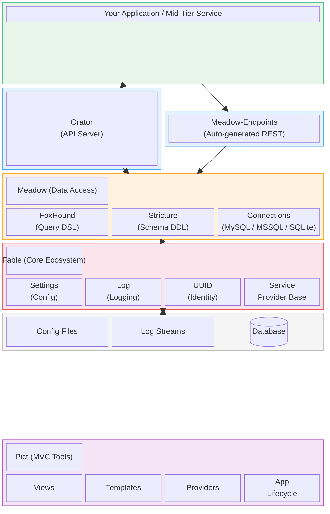

# Retold

> A story-obsessed application suite.

Retold is a collection of ~50 JavaScript/Node.js modules for building web applications and APIs. The modules span five groups — from core dependency injection up through data access, API serving, and full MVC — all designed to compose together through a shared service provider pattern.

## Architecture at a Glance

The modules build on each other in layers. A typical Retold application stacks up like this:



**Fable** is the foundation — every other module depends on it for dependency injection, configuration, logging, and UUID generation.

**Meadow** provides the data access layer. It uses **FoxHound** to generate SQL queries, **Stricture** to define schemas, and database-specific connection modules to talk to MySQL, MSSQL, or SQLite.

**Orator** wraps an HTTP server (Restify) to serve APIs. **Meadow-Endpoints** auto-generates RESTful CRUD routes from Meadow entities.

**Pict** provides Model-View-Controller patterns for browser, console, and text-based UIs. It connects to Fable for services and can use Meadow for data.

All modules follow the **Fable Service Provider Pattern**: they register with a Fable instance and gain access to logging, configuration, and each other through dependency injection.

## Module Groups

### [Fable](/fable/fable/) — Core Ecosystem

The foundation layer. Dependency injection, configuration, logging, UUID generation, expression parsing, REST client, and template engine.

**Key modules:** [fable](/fable/fable/) · [fable-log](/fable/fable-log/) · [fable-settings](/fable/fable-settings/) · [fable-uuid](/fable/fable-uuid/) · [fable-serviceproviderbase](/fable/fable-serviceproviderbase/)

### [Meadow](/meadow/meadow/) — Data Access Layer

Provider-agnostic data broker with schema management, query generation, and automatic audit tracking.

**Key modules:** [meadow](/meadow/meadow/) · [foxhound](/meadow/foxhound/) · [stricture](/meadow/stricture/) · [meadow-endpoints](/meadow/meadow-endpoints/) · [retold-data-service](/meadow/retold-data-service/)

### [Orator](/orator/orator/) — API Server

Thin HTTP server abstraction with REST and IPC support, static file serving, proxy pass-through, and WebSocket reporting.

**Key modules:** [orator](/orator/orator/) · [orator-serviceserver-restify](/orator/orator-serviceserver-restify/) · [orator-static-server](/orator/orator-static-server/)

### [Pict](/pict/pict/) — MVC Tools

Non-opinionated Model-View-Controller tools for building UIs as text strings — browser, console, or any text-based interface.

**Key modules:** [pict](/pict/pict/) · [pict-view](/pict/pict-view/) · [pict-application](/pict/pict-application/) · [pict-section-form](/pict/pict-section-form/)

### [Utility](/utility/indoctrinate/) — Build & Documentation Tools

Build tooling, manifest management, documentation generation, and process supervision.

**Key modules:** [indoctrinate](/utility/indoctrinate/) · [manyfest](/utility/manyfest/) · [quackage](/utility/quackage/) · [ultravisor](/utility/ultravisor/)

## Quick Start

```bash
# Install the core
npm install fable

# Add data access
npm install meadow foxhound stricture

# Add an API server
npm install orator orator-serviceserver-restify meadow-endpoints

# Add browser MVC
npm install pict
```

```javascript
const libFable = require('fable');

let _Fable = new libFable({
    Product: 'MyApp',
    ProductVersion: '1.0.0',
    LogLevel: 3
});

_Fable.log.info('Retold application started.');
```

## Learn More

- **[Architecture](architecture/architecture.md)** — Detailed layer-by-layer breakdown of the module stack
- **[Getting Started](getting-started.md)** — Building your first Retold application
- **[Examples](examples/examples.md)** — Complete runnable applications including the Todo List full-stack example
- **[Fable In Depth](modules/fable.md)** — The core ecosystem and service provider pattern
- **[Meadow In Depth](modules/meadow.md)** — Data access, schemas, and query generation
- **[Orator In Depth](modules/orator.md)** — API servers and endpoint generation
- **[Pict In Depth](modules/pict.md)** — MVC tools for browser and console UIs
- **[All Modules](modules/modules.md)** — Exhaustive list of every Retold repository

## License

MIT
