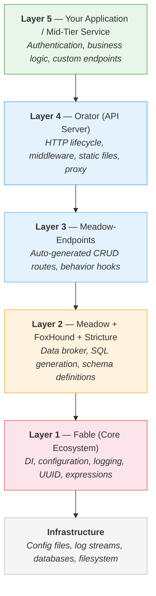
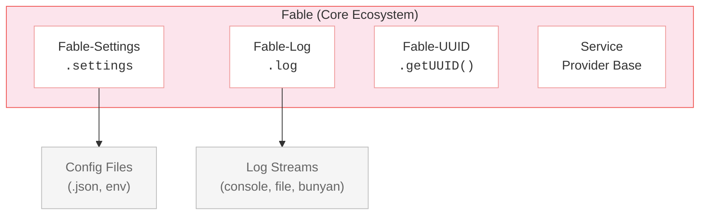
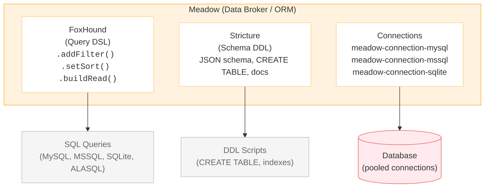
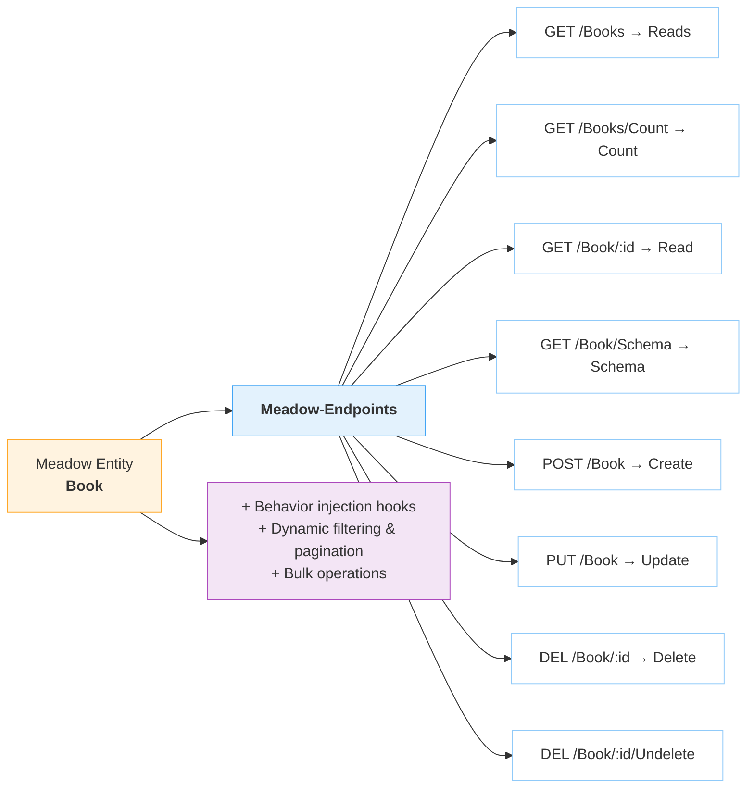
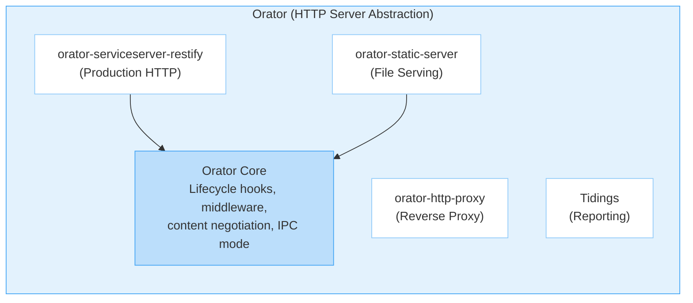
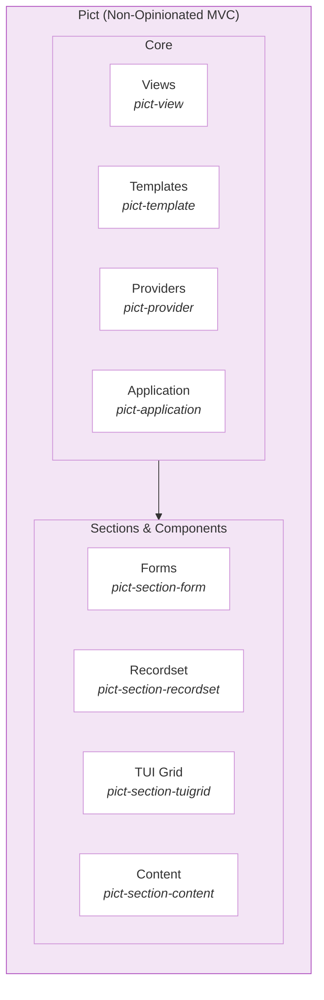
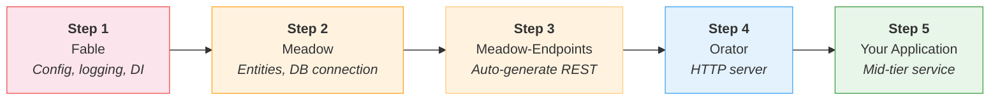

# Architecture

Retold modules are designed to compose into layered application stacks. Each layer builds on the one below it through the Fable service provider pattern.

## The Layer Model

A fully-realized Retold application assembles five layers, from infrastructure at the bottom to your application logic at the top.



Not every application uses every layer. A browser app might use Fable + Pict. A CLI tool might use Fable + Meadow. A full API service uses the complete stack.

## The Service Provider Pattern

Every Retold module extends `fable-serviceproviderbase`. This base class provides:

- **Registration** — Services register with a Fable instance by type and hash
- **Dependency access** — Any service can reach any other through `this.fable`
- **Logging** — Built-in `this.log` from Fable-Log
- **Configuration** — Shared settings through `this.fable.settings`
- **Identity** — UUID generation through `this.fable.getUUID()`

```javascript
const libFable = require('fable');
const libMeadow = require('meadow');
const libOrator = require('orator');

let _Fable = new libFable({ Product: 'MyApp', LogLevel: 3 });

// Services register themselves with the Fable instance
let _Meadow = _Fable.instantiateServiceProvider('Meadow');
let _Orator = _Fable.instantiateServiceProvider('Orator');

// Now every service can reach every other service
// _Meadow.fable.Orator, _Orator.fable.Meadow, etc.
```

This pattern means modules are loosely coupled. You can swap database providers, change API server implementations, or add custom services without modifying existing code.

## Layer 1: Fable — The Foundation

Fable is the only module that every other module depends on. It provides the core services that all other modules consume.



**Fable-Settings** loads and merges configuration from files, defaults, and runtime overrides into a single settings object.

**Fable-Log** provides six log levels (trace, debug, info, warn, error, fatal) with extensible output streams. Logs go to console by default; add bunyan or custom loggers as needed.

**Fable-UUID** generates RFC 4122 v4 UUIDs or configurable random strings for identity and uniqueness.

**Fable-ServiceProviderBase** is the base class all Retold services extend. It provides the registration and dependency injection mechanics.

Fable also bundles an expression parser, a REST client (Fable-RestClient), a template engine, date utilities, and data format helpers — all accessible as services.

## Layer 2: Meadow — Data Access

Meadow sits on top of Fable and provides a provider-agnostic data broker. You define entities once and access them through any supported database.



**Meadow** handles CRUD operations (Create, Read, Reads, Update, Delete, Count, Undelete), automatic audit columns (CreatingIDUser, UpdatingIDUser, timestamps), soft deletes, GUID uniqueness, and data marshalling.

**FoxHound** generates dialect-specific SQL from a single chainable API. One query definition produces correct SQL for MySQL, MSSQL, SQLite, or ALASQL (for in-browser use).

**Stricture** is an opinionated MicroDDL — define your data model in a simple text format and generate JSON schemas, MySQL CREATE statements, Meadow schema files, and documentation from a single source.

**Connection modules** (meadow-connection-mysql, meadow-connection-mssql, meadow-connection-sqlite) provide pooled database connections as Fable services.

## Layer 3: Meadow-Endpoints — Auto-Generated API

Meadow-Endpoints takes a Meadow entity definition and automatically generates a full suite of RESTful routes.



Behavior hooks let you inject authentication, authorization, validation, and transformation logic at any point in the request lifecycle — before or after each CRUD operation.

## Layer 4: Orator — API Server

Orator provides the HTTP server that hosts the endpoints from Layer 3 (and any custom routes).



Orator is deliberately thin. It provides a consistent interface regardless of the underlying server, so you can swap Restify for another implementation or use IPC mode for testing — without changing your application code.

## Pict — MVC Tools

Pict sits alongside the server stack, providing Model-View-Controller tools for any text-based UI: browser DOM, terminal, or rendered strings.



Pict's core philosophy: UI is text. Views render templates into strings. Providers fetch data. The Application class coordinates lifecycle. Sections provide pre-built patterns for common UI needs (forms, record lists, grids).

Pict connects to Fable for services and can use Meadow-Endpoints as its data source, but it has no hard dependency on the server stack.

## Putting It All Together

A full Retold application combines these layers. Here is the typical assembly order from the whiteboard architecture diagram:



```javascript
const libFable = require('fable');
const libOrator = require('orator');
const libMeadowEndpoints = require('meadow-endpoints');

let _Fable = new libFable({
    Product: 'BookService',
    LogLevel: 3,
    "MySQL": { "Server": "localhost", "User": "root", "Database": "bookstore" }
});

// Layer 2: Data access
let _MeadowEntity = _Fable.instantiateServiceProvider('Meadow',
    { Scope: 'Book', DefaultSchema: BookSchema });

// Layer 3: Auto-generate REST endpoints
let _Endpoints = _Fable.instantiateServiceProvider('MeadowEndpoints',
    { Entity: _MeadowEntity });

// Layer 4: HTTP server
let _Orator = _Fable.instantiateServiceProvider('Orator');

// Wire endpoints to the server
_Endpoints.connectRoutes(_Orator);

// Start listening
_Orator.startService((pError) =>
{
    _Fable.log.info('BookService is running on port 8086');
});
```

## Utility Modules

Supporting the application stack are utility modules:

| Module | Purpose |
|--------|---------|
| **[Manyfest](/utility/manyfest/)** | JSON manifest for consistent data description across layers |
| **[Quackage](/utility/quackage/)** | Standardized build tool for browser bundles, testing, and packaging |
| **[Indoctrinate](/utility/indoctrinate/)** | Documentation scaffolding, catalog generation, and cross-module search |
| **[Ultravisor](/utility/ultravisor/)** | Process supervision with scheduled tasks and LLM integration |
| **[Choreographic](/utility/choreographic/)** | Scaffolding for single-run data processing scripts |

## Design Principles

### Convention Over Configuration

Modules generate rich metadata automatically. A Meadow entity with a well-named schema and standard columns needs zero additional configuration to get a full REST API.

### Provider Agnostic

Data access, server implementations, and log destinations are all pluggable. Swap MySQL for SQLite, Restify for IPC, or console logging for Bunyan — without changing application code.

### Composable, Not Monolithic

Each module does one thing. Combine the modules you need; skip the rest. A CLI tool does not need Orator. A browser widget does not need Meadow.

### Everything is a Service

The service provider pattern means modules discover and use each other through dependency injection. No global state, no singletons, no import ordering problems.
