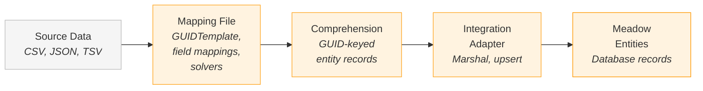
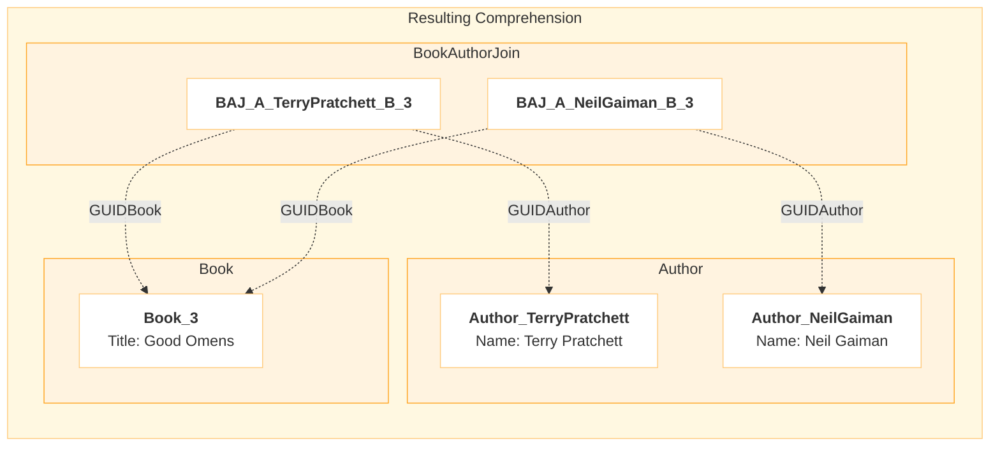
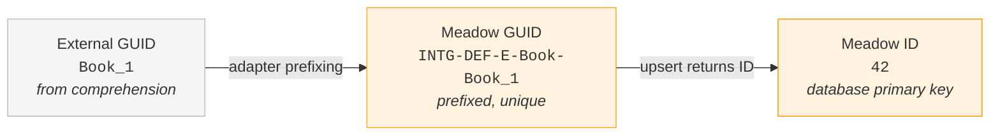

# Comprehensions

Comprehensions are the intermediate data format that Retold uses for data integration pipelines. When you need to ingest records from external systems — CSV files, JSON feeds, other databases — comprehensions provide a consistent structure for staging, deduplicating, merging, and cross-referencing that data before it reaches Meadow.

The modules [bibliograph](/meadow/bibliograph/) and [meadow-integration](/meadow/meadow-integration/) both work with comprehensions. Bibliograph provides key-value record comprehension for change tracking. Meadow-integration provides the full transformation and integration pipeline — mapping source data into comprehensions and pushing them into Meadow entities through the integration adapter.

## The Object Format

A comprehension is traditionally a JSON object where entity records are keyed by their GUID. This is the primary format and the one the integration pipeline works with internally.

```json
{
  "Book": {
    "Book_1": { "GUIDBook": "Book_1", "Title": "The Hunger Games", "ISBN": "9780439023481" },
    "Book_2": { "GUIDBook": "Book_2", "Title": "Dune", "ISBN": "9780441172719" }
  },
  "Author": {
    "Author_SuzanneCollins": { "GUIDAuthor": "Author_SuzanneCollins", "Name": "Suzanne Collins" },
    "Author_FrankHerbert": { "GUIDAuthor": "Author_FrankHerbert", "Name": "Frank Herbert" }
  }
}
```

Each top-level key is an entity name. Within each entity, records are stored as properties keyed by their GUID value. This gives you:

- **O(1) lookup** — find any record by GUID without scanning
- **Natural deduplication** — writing the same GUID twice merges rather than duplicates
- **Easy merging** — `Object.assign()` combines records from multiple sources
- **Multi-entity support** — a single comprehension can hold Books, Authors, and join records together

## The Array Format

Comprehensions can also be arrays of records. This format is useful for export, for consumption by tools that expect flat record lists, or for feeding data to systems and softwares that do not benefit from GUID-keyed lookup.

```json
[
  { "GUIDBook": "Book_1", "Title": "The Hunger Games", "ISBN": "9780439023481" },
  { "GUIDBook": "Book_2", "Title": "Dune", "ISBN": "9780441172719" }
]
```

The array format loses the O(1) lookup performance and the automatic deduplication of the object format. You convert between the two formats using the `comprehensionarray` command or the `/1.0/Comprehension/ToArray` endpoint.

## How Data Flows Through Comprehensions

Source data enters the integration pipeline through mapping files, gets staged as a comprehension, and then flows through the integration adapter into Meadow entities.



Mapping files control the transformation from source columns to comprehension fields. They define the entity name, the GUID template, and the field-by-field mappings using Pict template expressions.

## GUID Design

GUIDs are the primary key for comprehension records. Good GUID design ensures three things:

- **Uniqueness** — each record gets a distinct key
- **Determinism** — the same source data always generates the same GUID
- **Mergeability** — related data from different sources can be matched by GUID

GUID templates use Pict's jellyfish template syntax (`{~D:...~}`) to pull values from the source record:

```json
{
  "Entity": "Book",
  "GUIDTemplate": "Book_{~D:Record.id~}",
  "Mappings": {
    "Title": "{~D:Record.title~}",
    "ISBN": "{~D:Record.isbn~}"
  }
}
```

This produces records keyed by `Book_1`, `Book_2`, etc. When the same GUID template is used across multiple transform runs on different source files, records with matching GUIDs merge automatically in the comprehension.

## Combinatorial Keys

When no single source column provides a natural unique key, you build a combinatorial GUID from multiple columns.

```json
{
  "Entity": "Transaction",
  "GUIDTemplate": "TXN_{~D:Record.date~}_{~D:Record.account_id~}_{~D:Record.seq~}",
  "Mappings": {
    "Amount": "{~D:Record.amount~}",
    "AccountID": "{~D:Record.account_id~}",
    "TransactionDate": "{~D:Record.date~}"
  }
}
```

This produces GUIDs like `TXN_2025-02-17_12345_001` — unique across the combination of date, account, and sequence number. The composite key ensures that two transactions on the same day for the same account are distinguishable, while the determinism means re-running the transform on the same source data produces the same GUIDs (merging cleanly rather than creating duplicates).

Format modifiers like `{~PascalCaseIdentifier:Record.name~}` are useful in combinatorial keys when the source values contain spaces or special characters that would make messy GUIDs.

## The `_GUID` Prefix — Bypassing Magic Marshaling

When the integration adapter pushes comprehension records into Meadow, places a prefix on GUID fields based on the integration being run. This can signify the source system, data set or anything else the developer wants to connote in the GUID string itself. The underscore prefix controls which code path a GUID field takes.

**`GUIDBook`** — a field starting with `GUID` is treated as an **external system GUID**. The adapter runs it through the full marshaling pipeline: it looks up the external GUID in the mapping table to find the corresponding Meadow numeric ID, and writes that ID into the output record as `IDBook`.

**`_GUIDBook`** — a field starting with `_GUID` is treated as a **Meadow GUID** that already exists in the system. The adapter skips the external-to-internal translation and does a direct lookup from Meadow GUID to numeric ID. No prefix magic is applied.

```json
{
  "BookReview": {
    "Review_1": {
      "GUIDBookReview": "Review_1",
      "GUIDBook": "Book_1",
      "_GUIDUser": "0x01234567"
    }
  }
}
```

In this example, `GUIDBook` with value `Book_1` is an external key from the comprehension — the adapter will look up what Meadow ID corresponds to external GUID `Book_1`. But `_GUIDUser` with value `0x01234567` is already a Meadow GUID — the adapter looks it up directly without applying the integration prefix.

The distinction matters when you are integrating data that references both external records (from the same import batch) and existing Meadow records (already in the database). Use `GUID` for references within the comprehension. Use `_GUID` when pointing at records that already exist in Meadow.

## Cross-Connecting Recordsets

Comprehensions handle relationships between entities through GUID cross-references. A record in one entity can reference records in other entities by including `GUID`-prefixed fields that match the target entity's GUID values.

### Join Tables from a Single Source

A common pattern is generating join table records from a single source that contains embedded relationships. For example, a books CSV where the `authors` column contains comma-separated names:

```
id,title,authors
1,The Hunger Games,"Suzanne Collins"
2,Dune,"Frank Herbert"
3,Good Omens,"Terry Pratchett,Neil Gaiman"
```

Three mapping files transform this one CSV into three related entity sets:

**Books:**
```json
{
  "Entity": "Book",
  "GUIDTemplate": "Book_{~D:Record.id~}",
  "Mappings": { "Title": "{~D:Record.title~}" }
}
```

**Authors** (one source row can produce multiple records):
```json
{
  "Entity": "Author",
  "MultipleGUIDUniqueness": true,
  "Solvers": [
    "NewRecordsGUIDUniqueness = STRINGGETSEGMENTS(IncomingRecord.authors,\",\")"
  ],
  "GUIDTemplate": "Author_{~PascalCaseIdentifier:Record._GUIDUniqueness~}",
  "Mappings": { "Name": "{~D:Record._GUIDUniqueness~}" }
}
```

**BookAuthorJoin** (cross-references both entities):
```json
{
  "Entity": "BookAuthorJoin",
  "MultipleGUIDUniqueness": true,
  "Solvers": [
    "NewRecordsGUIDUniqueness = STRINGGETSEGMENTS(IncomingRecord.authors,\",\")"
  ],
  "GUIDTemplate": "BAJ_A_{~PascalCaseIdentifier:Record._GUIDUniqueness~}_B_{~D:Record.id~}",
  "Mappings": {
    "GUIDBook": "Book_{~D:Record.id~}",
    "GUIDAuthor": "Author_{~PascalCaseIdentifier:Record._GUIDUniqueness~}"
  }
}
```

The `MultipleGUIDUniqueness` flag combined with a Solver expression splits the comma-separated authors into individual entries. For each entry, the system creates a separate record with `_GUIDUniqueness` set to that entry's value. The GUID template and mappings use `_GUIDUniqueness` to build unique keys and cross-references.

For "Good Omens" with two authors, this produces:



The join records contain `GUIDBook` and `GUIDAuthor` fields whose values match the GUIDs of the Book and Author entities. When the integration adapter pushes these records to Meadow, it resolves each GUID cross-reference to the corresponding numeric ID, producing proper foreign key relationships in the database.

### Merging Across Sources

When the same entities have data spread across multiple source files, comprehension merging combines them by GUID. The `comprehensionintersect` command (or `/1.0/Comprehension/Intersect` endpoint) takes two comprehensions and merges records with matching GUIDs:

```json
// Primary: population data
{
  "Neighborhood": {
    "SEATTLE_BALLARD": { "GUIDNeighborhood": "SEATTLE_BALLARD", "Name": "Ballard", "Population": 50000 }
  }
}

// Secondary: housing data
{
  "Neighborhood": {
    "SEATTLE_BALLARD": { "GUIDNeighborhood": "SEATTLE_BALLARD", "MedianHomePrice": 750000 }
  }
}

// Merged result
{
  "Neighborhood": {
    "SEATTLE_BALLARD": { "GUIDNeighborhood": "SEATTLE_BALLARD", "Name": "Ballard", "Population": 50000, "MedianHomePrice": 750000 }
  }
}
```

This is why deterministic GUID design matters — when two sources use the same GUID template for the same logical entity, their data merges cleanly.

## The Integration Adapter: GUID to Database ID

When comprehension records are pushed into Meadow through the integration adapter, a three-layer GUID transformation maps external identifiers to database IDs:



1. The external GUID from the comprehension (e.g. `Book_1`) gets a configurable prefix applied by the adapter, producing a Meadow GUID (e.g. `INTG-DEF-E-Book-Book_1`)
2. The adapter upserts the record to the Meadow API. The server returns the numeric database ID
3. The GUIDMap service tracks the bidirectional mapping: external GUID to Meadow GUID to database ID

This mapping persists across the entire integration run. When later entities reference `GUIDBook: "Book_1"`, the adapter looks up the mapping and resolves it to the correct numeric `IDBook` value. Entity integration order matters — referenced entities must be pushed before the entities that reference them.
