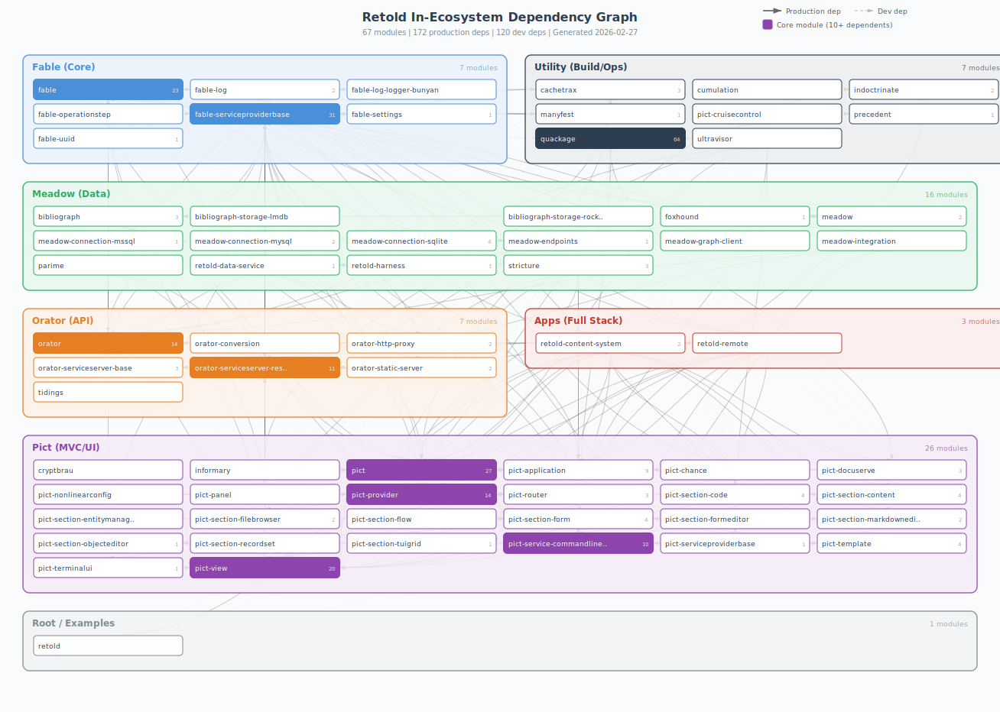

# Retold In-Ecosystem Dependency Graph

This document maps the internal dependency relationships between all modules in the Retold ecosystem. It covers production and development dependencies where both the consumer and the dependency are Retold modules.

Generated: 2026-02-27

## Visual Graph



Core modules (10+ dependents) are highlighted with filled backgrounds. The number in each node indicates how many other modules depend on it.

## Summary

| Metric | Value |
|---|---|
| Total ecosystem modules | 77 |
| Module-category nodes | 67 |
| Example/internal nodes | 10 |
| Production dependency edges | 212 |
| Development dependency edges | 122 |
| Total in-ecosystem edges | 334 |
| Dependency depth (max groups) | 9 (groups 0-8) |

## Module Groups

| Group | Count | Role |
|---|---|---|
| **Fable** | 7 | Core: dependency injection, config, logging, UUID, expression parsing, REST client, templates |
| **Meadow** | 16 | Data: ORM, query DSL, schema definitions, DB connectors, REST endpoint generation |
| **Orator** | 7 | API: server framework, static files, HTTP proxy, WebSocket |
| **Pict** | 26 | MVC/UI: views, templates, providers, application lifecycle, form builders, TUI, CLI |
| **Utility** | 8 | Build/ops: build tools, manifest management, docs, process supervision, caching |
| **Apps** | 2 | Full-stack: content management, remote access |
| **Root** | 11 | Meta-package, examples, quickstarts |

## Core Modules (Most Depended Upon)

These modules form the critical path of the ecosystem. Changes here have the widest blast radius.

| Module | Group | Dependents | Role |
|---|---|---|---|
| **quackage** | utility | 66 | Build tool (devDep in nearly every module) |
| **fable-serviceproviderbase** | fable | 32 | Base class for all service providers |
| **fable** | fable | 31 | Core framework with DI container |
| **pict** | pict | 31 | Main MVC framework package |
| **pict-view** | pict | 24 | View base class |
| **orator** | orator | 17 | API server framework |
| **pict-provider** | pict | 16 | Provider base class |
| **orator-serviceserver-restify** | orator | 14 | Restify server implementation |
| **pict-application** | pict | 13 | Application lifecycle |
| **pict-service-commandlineutility** | pict | 11 | CLI framework |

## Topological Groups (Dependency Depth)

Modules at Group 0 have no ecosystem production dependencies. Each subsequent group depends on modules from lower groups. This ordering defines the safe update sequence: update from the bottom up.

### Group 0 — Foundations (5 modules)

No ecosystem production dependencies. These are leaf nodes.

| Module | Group |
|---|---|
| bibliograph-storage-lmdb | meadow |
| cryptbrau | pict |
| cumulation | utility |
| **fable-serviceproviderbase** | fable |
| precedent | utility |

### Group 1 — Base Services (17 modules)

Depend only on Group 0 modules.

| Module | Group | Depends On |
|---|---|---|
| cachetrax | utility | fable-serviceproviderbase |
| fable-log | fable | fable-serviceproviderbase |
| fable-operationstep | fable | fable-serviceproviderbase |
| fable-settings | fable | fable-serviceproviderbase, precedent |
| fable-uuid | fable | fable-serviceproviderbase |
| manyfest | utility | fable-serviceproviderbase |
| meadow-connection-mssql | meadow | fable-serviceproviderbase |
| meadow-connection-mysql | meadow | fable-serviceproviderbase |
| meadow-connection-sqlite | meadow | fable-serviceproviderbase |
| meadow-graph-client | meadow | fable-serviceproviderbase |
| orator-conversion | orator | fable-serviceproviderbase |
| orator-serviceserver-base | orator | fable-serviceproviderbase |
| orator-static-server | orator | fable-serviceproviderbase |
| pict-application | pict | fable-serviceproviderbase |
| pict-chance | pict | fable-serviceproviderbase |
| pict-provider | pict | fable-serviceproviderbase |
| pict-template | pict | fable-serviceproviderbase |

### Group 2 — Framework Core (7 modules)

| Module | Group | Depends On |
|---|---|---|
| **fable** | fable | cachetrax, fable-log, fable-serviceproviderbase, fable-settings, fable-uuid, manyfest |
| fable-log-logger-bunyan | fable | fable-log |
| informary | pict | cachetrax |
| **orator** | orator | fable-serviceproviderbase, orator-serviceserver-base, orator-static-server |
| orator-http-proxy | orator | orator-serviceserver-base |
| orator-serviceserver-restify | orator | orator-serviceserver-base |
| pict-router | pict | pict-provider |

### Group 3 — Derived Services (6 modules)

| Module | Group | Depends On |
|---|---|---|
| foxhound | meadow | fable |
| **pict-view** | pict | fable, fable-serviceproviderbase |
| tidings | orator | fable, orator |

### Group 4 — Composite Modules (9 modules)

| Module | Group | Depends On |
|---|---|---|
| **meadow** | meadow | foxhound |
| **pict** | pict | cachetrax, fable, pict-application, pict-provider, pict-template, pict-view |
| pict-cruisecontrol | utility | pict-view |
| pict-panel | pict | fable-serviceproviderbase, pict-provider, pict-template, pict-view |
| pict-section-code | pict | pict-view |
| pict-section-filebrowser | pict | fable, fable-serviceproviderbase, orator, orator-serviceserver-restify, pict-provider, pict-view |
| pict-section-flow | pict | fable-serviceproviderbase, pict-provider, pict-view |
| pict-section-objecteditor | pict | pict-view |
| pict-section-tuigrid | pict | pict-view |

### Group 5 — Higher-Level Sections (11 modules)

| Module | Group | Depends On |
|---|---|---|
| bibliograph | meadow | pict, pict-provider |
| meadow-endpoints | meadow | fable, meadow, orator |
| pict-nonlinearconfig | pict | pict, pict-application, pict-provider, pict-router, pict-view |
| pict-section-content | pict | pict-provider, pict-section-code, pict-view |
| pict-section-form | pict | fable-serviceproviderbase, pict-provider, pict-section-tuigrid, pict-template, pict-view |
| pict-service-commandlineutility | pict | fable-serviceproviderbase, pict |
| pict-serviceproviderbase | pict | fable-serviceproviderbase, pict |
| pict-terminalui | pict | fable, fable-serviceproviderbase, pict, pict-application, pict-view |

### Group 6 — Integration Modules (15 modules)

| Module | Group | Depends On |
|---|---|---|
| bibliograph-storage-rocksdb | meadow | bibliograph |
| indoctrinate | utility | pict-service-commandlineutility |
| meadow-integration | meadow | fable, fable-serviceproviderbase, orator, orator-serviceserver-restify, pict-service-commandlineutility |
| parime | meadow | bibliograph, orator, orator-serviceserver-restify, pict |
| pict-docuserve | pict | pict, pict-application, pict-provider, pict-section-content, pict-service-commandlineutility, pict-view |
| pict-section-entitymanagement | pict | pict-router, pict-section-form |
| pict-section-markdowneditor | pict | pict-section-content, pict-view |
| pict-section-recordset | pict | fable-serviceproviderbase, pict-provider, pict-router, pict-section-form, pict-template, pict-view |
| retold-data-service | meadow | fable, fable-serviceproviderbase, meadow, meadow-connection-mysql, meadow-endpoints, orator, orator-http-proxy, orator-serviceserver-restify, orator-static-server |
| stricture | meadow | pict, pict-application, pict-service-commandlineutility, pict-terminalui, pict-view |
| ultravisor | utility | orator, orator-serviceserver-restify, pict, pict-service-commandlineutility, pict-serviceproviderbase |

### Group 7 — Application Components (4 modules)

| Module | Group | Depends On |
|---|---|---|
| pict-section-formeditor | pict | pict-section-code, pict-section-content, pict-section-form, pict-section-markdowneditor, pict-section-objecteditor, pict-view |
| quackage | utility | indoctrinate, pict-docuserve, pict-service-commandlineutility |
| retold-content-system | apps | fable, orator, orator-serviceserver-restify, pict, pict-application, pict-docuserve, pict-provider, pict-section-code, pict-section-content, pict-section-filebrowser, pict-section-markdowneditor, pict-service-commandlineutility, pict-view |
| retold-harness | meadow | meadow-connection-sqlite, retold-data-service |

### Group 8 — Top-Level Applications (2 modules)

| Module | Group | Depends On |
|---|---|---|
| retold | root | retold-content-system |
| retold-remote | apps | fable, fable-serviceproviderbase, orator, orator-serviceserver-restify, pict, pict-application, pict-provider, pict-section-code, pict-section-filebrowser, pict-service-commandlineutility, pict-view, retold-content-system |

## Architectural Dependency Flow

The general dependency flow follows the Retold architectural groups:

```
 Group 0   fable-serviceproviderbase, precedent, cryptbrau, cumulation
              |
 Group 1   fable-log, fable-settings, fable-uuid, cachetrax, manyfest
           meadow-connection-*, orator-serviceserver-base, orator-static-server
           pict-application, pict-provider, pict-template
              |
 Group 2   fable, orator, orator-serviceserver-restify, orator-http-proxy
           pict-router
              |
 Group 3   foxhound, pict-view, tidings
              |
 Group 4   meadow, pict, pict-section-* (basic)
              |
 Group 5   meadow-endpoints, pict-section-form, pict-service-commandlineutility
           pict-terminalui, bibliograph
              |
 Group 6   retold-data-service, stricture, indoctrinate, pict-docuserve
           pict-section-recordset, ultravisor
              |
 Group 7   quackage, retold-content-system, retold-harness
              |
 Group 8   retold, retold-remote
```

## Update Order

When performing ecosystem-wide updates, follow the topological group order (bottom-up):

1. **Group 0** first — `fable-serviceproviderbase`, `precedent`
2. **Group 1** — `fable-log`, `fable-settings`, `fable-uuid`, `cachetrax`, `manyfest`, connection modules, `pict-application`, `pict-provider`, `pict-template`
3. **Group 2** — `fable`, `orator`, `orator-serviceserver-restify`
4. **Group 3** — `foxhound`, `pict-view`
5. **Group 4** — `meadow`, `pict`, basic pict-section modules
6. **Group 5** — `meadow-endpoints`, `pict-section-form`, `pict-service-commandlineutility`
7. **Group 6** — `retold-data-service`, `stricture`, `indoctrinate`, `pict-docuserve`
8. **Group 7** — `quackage`, `retold-content-system`, `retold-harness`
9. **Group 8** — `retold`, `retold-remote`

## Data Files

- **[in-ecosystem-dependency-graph.json](in-ecosystem-dependency-graph.json)** — Machine-readable graph with nodes, edges, groups, and analytics
- **[in-ecosystem-dependency-graph.svg](in-ecosystem-dependency-graph.svg)** — Visual dependency graph
- **[_generate-graph.js](_generate-graph.js)** — Script to regenerate the JSON from package.json files
- **[_generate-svg.js](_generate-svg.js)** — Script to regenerate the SVG from the JSON
