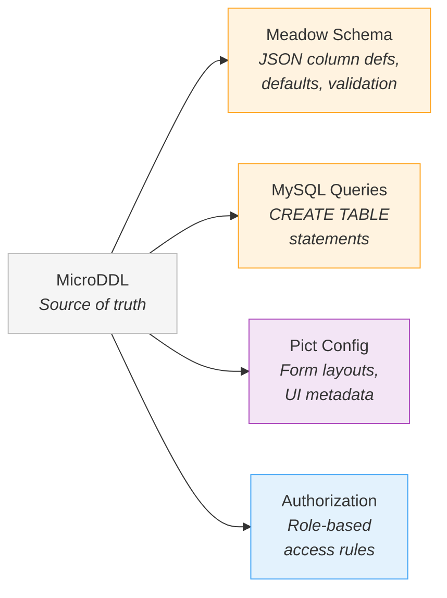

# Fluid Models

In most application frameworks, a data model is a rigid artifact. You define it once in a migration file or a class, and it becomes the fixed skeleton of your application. Changing it means writing migration scripts, updating API contracts, rebuilding forms, and hoping nothing breaks.

Retold takes a different position: **the model is a living thing**. Data models are easy to describe, easy to mutate, and designed to flow through every layer of the stack — from a terse text definition, through database tables and API endpoints, all the way to browser form fields — adapting their shape at each layer without losing their identity.

## Describing a Model

The fastest way to describe a data model in Retold is Stricture's MicroDDL — a compact text notation where each line defines a column using a single-character sigil.

A classic order management system (think Northwind) might start like this:

```
!Customer
@IDCustomer
%GUIDCustomer
$CompanyName 128
$ContactName 128
$ContactTitle 64
$Phone 24
$City 64
$Country 64
&CreateDate
#CreatingIDUser
&UpdateDate
#UpdatingIDUser
^Deleted
&DeleteDate
#DeletingIDUser

!Product
@IDProduct
%GUIDProduct
$ProductName 128
.UnitPrice 10,2
#UnitsInStock
~IDSupplier -> IDSupplier
&CreateDate
#CreatingIDUser
&UpdateDate
#UpdatingIDUser
^Deleted
&DeleteDate
#DeletingIDUser

!Order
@IDOrder
%GUIDOrder
~IDCustomer -> IDCustomer
&OrderDate
$ShipCity 64
$ShipCountry 64
&CreateDate
#CreatingIDUser
&UpdateDate
#UpdatingIDUser
^Deleted
&DeleteDate
#DeletingIDUser

!OrderDetail
@IDOrderDetail
%GUIDOrderDetail
~IDOrder -> IDOrder
~IDProduct -> IDProduct
.UnitPrice 10,2
#Quantity
.Discount 5,2
&CreateDate
#CreatingIDUser
&UpdateDate
#UpdatingIDUser
^Deleted
&DeleteDate
#DeletingIDUser
```

The sigils are deliberate shorthand:

| Sigil | Type | Example |
|-------|------|---------|
| `!` | Table definition | `!Customer` |
| `@` | Auto-incrementing ID | `@IDCustomer` |
| `%` | GUID | `%GUIDCustomer` |
| `$` | String (with size) | `$CompanyName 128` |
| `#` | Integer | `#UnitsInStock` |
| `.` | Decimal (precision,scale) | `.UnitPrice 10,2` |
| `&` | DateTime | `&OrderDate` |
| `^` | Boolean | `^Deleted` |
| `~` | Foreign key | `~IDCustomer -> IDCustomer` |
| `*` | Text (unbounded) | `*Description` |

This is the entire data model for four related entities. No XML, no decorators, no class hierarchies. The definition is compact enough to hold in your head and quick enough to change on a whiteboard.

## One Definition, Many Shapes

From this single MicroDDL source, Stricture generates multiple representations:



Each output is a different shape of the same logical model:

**Meadow Schema** — JSON column definitions that drive the ORM, query generation, default objects, and JSON Schema validation:

```json
{
  "Scope": "Customer",
  "DefaultIdentifier": "IDCustomer",
  "Schema": [
    { "Column": "IDCustomer", "Type": "AutoIdentity" },
    { "Column": "GUIDCustomer", "Type": "AutoGUID" },
    { "Column": "CompanyName", "Type": "String", "Size": "128" },
    { "Column": "ContactName", "Type": "String", "Size": "128" },
    { "Column": "City", "Type": "String", "Size": "64" },
    { "Column": "CreateDate", "Type": "CreateDate" },
    { "Column": "UpdateDate", "Type": "UpdateDate" },
    { "Column": "Deleted", "Type": "Deleted" }
  ],
  "DefaultObject": {
    "IDCustomer": 0,
    "GUIDCustomer": "",
    "CompanyName": "",
    "ContactName": "",
    "City": ""
  }
}
```

**MySQL DDL** — CREATE TABLE statements ready to run against a database.

**Pict Configuration** — UI definitions for form views, list views, and record views — which fields to show, how to group them, what input types to use.

## The Model Changes Shape at Every Layer

Consider a modern social platform with Users, Posts, and Comments. Watch how the model's shape changes as it flows through the stack — and how Retold makes that natural rather than painful.

### At the Schema Layer

The MicroDDL is terse and structural:

```
!User
@IDUser
%GUIDUser
$UserName 64
$Email 256
$DisplayName 128
&CreateDate
#CreatingIDUser
&UpdateDate
#UpdatingIDUser
^Deleted
&DeleteDate
#DeletingIDUser

!Post
@IDPost
%GUIDPost
~IDUser -> IDUser
$Title 256
*Body
&PublishedDate
&CreateDate
#CreatingIDUser
&UpdateDate
#UpdatingIDUser
^Deleted
&DeleteDate
#DeletingIDUser

!Comment
@IDComment
%GUIDComment
~IDPost -> IDPost
~IDUser -> IDUser
*Body
&CreateDate
#CreatingIDUser
&UpdateDate
#UpdatingIDUser
^Deleted
&DeleteDate
#DeletingIDUser
```

### At the Database Layer

Meadow consumes the schema and automatically handles audit columns. When you create a Post, you send:

```javascript
{ Title: 'Hello World', Body: 'First post!', IDUser: 42 }
```

Meadow merges your data with the schema's default object and fills in the audit columns:

```javascript
{
  IDPost: 0,                          // from defaults
  GUIDPost: '8f14e45f-...',          // auto-generated
  Title: 'Hello World',              // from your data
  Body: 'First post!',               // from your data
  IDUser: 42,                        // from your data
  PublishedDate: null,                // from defaults
  CreateDate: '2025-02-17 14:30:00', // auto-stamped
  CreatingIDUser: 42,                // auto-stamped from session
  UpdateDate: '2025-02-17 14:30:00', // auto-stamped
  UpdatingIDUser: 42,                // auto-stamped from session
  Deleted: 0                         // from defaults
}
```

The schema knows which columns are audit columns by their type (`CreateDate`, `UpdateDate`, `Deleted`). Meadow inspects the schema on every operation — not just at startup — so changing the schema changes behavior immediately.

### At the Query Layer

FoxHound reads the schema to generate intelligent queries. If the schema includes a `Deleted` column with type `Deleted`, every read query automatically adds `WHERE Deleted = 0`. You never write that filter. The schema declares the intent; the query layer implements it.

```javascript
// You write:
_PostMeadow.doReads(_PostMeadow.query.addFilter('IDUser', 42), fCallback);

// FoxHound generates (simplified):
// SELECT * FROM Post WHERE IDUser = 42 AND Deleted = 0
```

### At the API Layer

Meadow-Endpoints reads the same schema and generates a full REST API. The schema's authorization rules control who can do what:

```
GET  /Posts              → list (filtered by Deleted automatically)
GET  /Post/42            → read single
POST /Post               → create (audit columns auto-stamped)
PUT  /Post               → update (UpdateDate auto-stamped)
DEL  /Post/42            → soft delete (sets Deleted = 1)
GET  /Post/Schema        → returns the live schema JSON
```

The `GET /Post/Schema` endpoint is important — it exposes the current schema to any client. This means the model is not hidden inside server code. It is a queryable, inspectable resource.

### At the UI Layer

Pict reads the schema through Manyfest descriptors and generates form fields. Each column gains UI metadata:

```javascript
{
  Hash: 'Title',
  Name: 'Post Title',
  DataType: 'String',
  PictForm: {
    InputType: 'TextInput',
    Section: 'PostDetails',
    Row: 0
  }
}
```

The same address notation — `Record.Title`, `AppData.Posts[0].Body` — works in templates, in code, and in form bindings. Manyfest provides safe navigation that never throws on missing paths, so the UI does not break when the model evolves.

## Runtime Mutation

The model is not frozen after compilation. Meadow schemas are live objects with independent, replaceable parts:

```javascript
// Load initial schema
_PostMeadow.loadFromPackage('./Post-Schema.json');

// Later, update just the column definitions
_PostMeadow.setSchema(updatedColumnArray);

// Or just the validation rules
_PostMeadow.setJsonSchema(updatedValidationSchema);

// Or just the default values
_PostMeadow.setDefault({ ...existingDefaults, NewField: 'default' });

// Or just the authorization policies
_PostMeadow.setAuthorizer(updatedAuthRules);
```

Each part — column definitions, JSON Schema validation, default objects, authorization — can be modified independently. When you call `setSchema()`, the change propagates immediately to the database provider. Subsequent queries, creates, and updates use the new definition. There is no restart, no cache flush, no migration ceremony.

This matters for real applications. A bookstore that adds a `Price` column to its `Book` entity:

```javascript
// Existing schema
let schema = _BookMeadow.schema;

// Add the new column
schema.push({ Column: 'Price', Type: 'Decimal', Size: '10,2' });

// Update live
_BookMeadow.setSchema(schema);
_BookMeadow.setDefault({ ...existingDefaults, Price: 0.0 });

// All subsequent operations include Price
```

The database table still needs an `ALTER TABLE` — Retold does not run migrations for you. But the application layer adapts instantly. You can evolve the schema in code, test the new shape, and apply the database change when ready.

## Address-Based Access Across Layers

Manyfest provides the glue that makes model fluidity practical. Every piece of data in a Retold application is reachable through an address — a dot-notation string like `Record.Contact.Email` or `AppData.Posts[0].Title`.

```javascript
// Safe read — returns undefined if any part of the path is missing
let title = _Manyfest.getValueAtAddress(pRecord, 'Posts[0].Title');

// Safe write — creates intermediate objects as needed
_Manyfest.setValueAtAddress(pRecord, 'Posts[0].Title', 'Updated Title');
```

The same address notation works in Pict templates:

```
{~Data:Record.Title~}
{~Data:AppData.Posts[0].Title~}
{~Data:Bundle.Authors.ByID.42.Name~}
```

And in form bindings, where the template address maps directly to a Manyfest descriptor, which maps to a Meadow column, which maps to a database field. One notation from top to bottom.

When the model changes shape — a field is renamed, a nested object is restructured, a new relationship is added — the address is the single point of update. Change the address in the Manyfest descriptor and every layer that references it adapts.

## Why This Matters

In a traditional framework, changing a data model means touching every layer: migration files, ORM classes, API serializers, validation schemas, form definitions, and template bindings. Each layer has its own notation for describing the same thing, and keeping them synchronized is the source of a large class of bugs.

Retold's approach is different:

- **One source** (MicroDDL) generates all layer-specific representations
- **One notation** (Manyfest addresses) accesses data everywhere
- **One schema object** (Meadow) drives queries, validation, defaults, and authorization
- **Live mutation** means the model evolves without restarts or redeployment ceremonies
- **Schema introspection** at operation time means changes take effect immediately

The model is not a static artifact that you deploy and forget. It is a fluid description that adapts to each layer's needs and evolves with your application.
