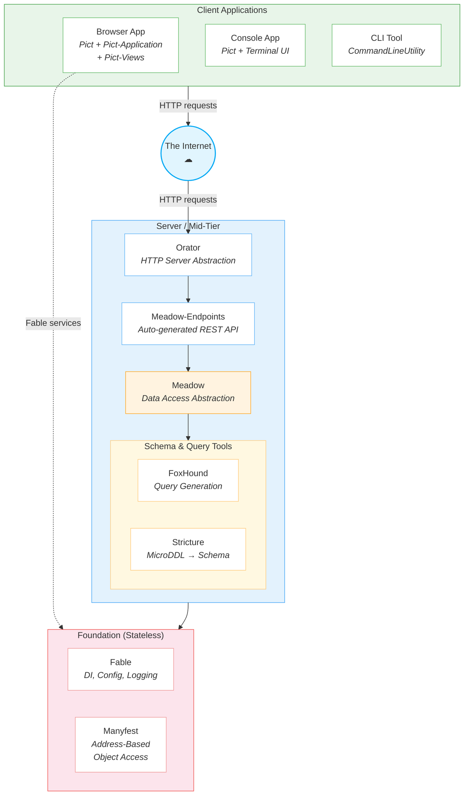
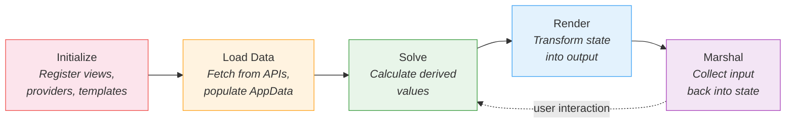

# Ecosystem Architecture - Module Philosophy

Retold modules each embody a specific design philosophy. Together they form a coherent system for building applications — from the stateless service core, through data access and API generation, up to state-driven UI rendering.  At the same time, each module is designed to be used (*and useful*) independently. You can adopt Fable's configuration and logging without using Pict. You can use Meadow for data access without Orator. These modules are decoupled by design, but also fit together in a complementary way.



Clients — browsers, terminals, CLI tools — communicate with the server over HTTP. Orator receives those requests, Meadow-Endpoints maps them to data operations, and Meadow executes them against the database. Fable provides the stateless service container that every module on both sides of the network depends on. Manyfest provides the consistent data-addressing language used everywhere.

---

## Fable Is Stateless

Fable draws a hard line between **configuration** and **state**.

In Retold's vocabulary, *state* is **application data** — the records in a database, the items in a shopping cart, the text a user has typed into a form. State changes as users interact with the system. It is the core subject matter of the application.

Configuration is everything else: the address of the database server, the port the API listens on, the log level, the product name. Configuration describes how the application runs in its environment, not what the application is doing. Fable manages configuration. It does not manage state.

This distinction matters because the "Out of the Tar Pit" problem — the paper Fable's design references — identifies uncontrolled state as the primary source of software complexity. By keeping the service container stateless, Fable ensures that the foundation layer has no opinion about your data. Services register with Fable, receive configuration and logging, and operate on whatever data flows through them without Fable holding onto it.

Every Retold module extends `fable-serviceproviderbase` and registers with a Fable instance. That instance provides dependency injection, logging, UUID generation, and shared settings. But the Fable instance itself stores no application data. It is the wiring, not the warehouse.

## Pict Is for State and Transformation

If Fable is deliberately stateless, Pict is deliberately stateful. Pict's job is to hold application state and transform it consistently into output using a templating language.

Pict provides three dedicated state containers:

| Container | Purpose | Example Contents |
|-----------|---------|------------------|
| **AppData** | Primary application state | User records, form values, loaded entities |
| **Bundle** | Supporting reference data | Lookup tables, dropdown options, translations |
| **TempData** | Ephemeral intermediate data | Chart caches, calculated summaries, UI flags |

All state lives in known locations. Templates reference state through address expressions like `AppData.Tasks[0].Name`. Code accesses the same state through the same addresses. There is one source of truth and one notation for reaching it.

The key insight is that **state and lifecycle are coupled**. Pict's lifecycle phases — Solve, Render, Marshal — all operate on these state containers:

1. **Solve** reads state and writes derived values back into state
2. **Render** reads state and produces output through templates
3. **Marshal** collects input and writes it back into state

This cycle is predictable and debuggable. At any point in the lifecycle you can inspect the state containers and know exactly what data the application is working with.

Pict intentionally separates logic from templates. Templates describe *what* to render; code (in views and providers) describes *when* and *how* data moves. You can override templates without altering behavior, and you can alter behavior without touching templates.

## Pict-Application Manages the Lifecycle

Pict-Application is the orchestration layer. It coordinates the startup, data loading, solving, rendering, and marshaling of an entire application composed of multiple views and providers.

The lifecycle follows a defined sequence:



Each view and provider within the application participates in these phases. Pict-Application ensures they execute in the correct order (controlled by configurable ordinals) and provides auto-behaviors to reduce boilerplate — for example, automatically solving and rendering after initialization completes.

The application also manages authentication flows, data loading sequences, and the coordination between views that need to share state. It is the conductor; views and providers are the musicians.

## Pict-View Is Not Just a Screen

A Pict view is any representation of information. It is not a page. It is not a screen. It is not a route.

A single screen might contain dozens of views: a header view, a navigation view, a list view, a detail panel view, a status bar view. Or a single view might render to a log file, a terminal widget, or a test harness instead of a browser DOM. The view is the unit of *rendering*, not the unit of *navigation*.

Each view contains **renderables** — individual render instructions that specify:

- Which **template** to use
- Which **data address** to read from state
- Which **destination** to render into
- Which **method** to use (replace, append, prepend)

This makes views composable. Small views handle small concerns. Larger patterns emerge from combining them. A form section view renders input fields. A recordset view renders a list of records. A content view renders static markup. You assemble an application from these building blocks.

Because views render through a content assignment abstraction, they are not bound to the browser DOM. The same view code can render to a blessed terminal widget, a log stream, or a mock environment for testing — by swapping the content assignment functions. The view does not know or care where its output ends up.

## Orator Abstracts Web Servers

Orator provides a thin abstraction over HTTP servers. Your application code interacts with Orator's interface — defining routes, middleware, and lifecycle hooks — without coupling to a specific server implementation.

The default implementation uses Restify (`orator-serviceserver-restify`), but the abstraction means you could swap in a different HTTP library or use IPC mode for testing without changing application routes or middleware. Orator handles the HTTP lifecycle: receiving requests, running middleware, dispatching to handlers, and sending responses.

Orator also provides static file serving (`orator-static-server`) and reverse proxy capabilities (`orator-http-proxy`), making it a complete server-side HTTP toolkit without being a heavyweight framework.

The philosophy is deliberate thinness. Orator does not dictate application structure. It provides the plumbing for getting HTTP requests to your code and responses back to the client.

## Meadow Abstracts Data Access

Meadow is a provider-agnostic data broker. You define entities once — their fields, types, and relationships — and Meadow handles CRUD operations against whatever database is connected.

The abstraction has real teeth: the same Meadow entity definition works with MySQL, MSSQL, SQLite, and ALASQL (for in-browser use). Switch databases by swapping a connection module. Your application code, entity definitions, and endpoint configurations do not change.

Meadow automatically manages audit columns (who created a record, who last updated it, and when), soft deletes (marking records as deleted without removing them), GUID-based uniqueness, and data marshalling between JavaScript objects and database rows.

The data access pattern is deliberately simple: Create, Read, Reads (list), Update, Delete, Count, and Undelete. These seven operations cover the vast majority of data access needs. When they do not, behavior hooks let you inject custom logic at any point in the operation lifecycle.

## Meadow-Endpoints Connects Data Access to a Consistent API

Meadow-Endpoints takes a Meadow entity and automatically generates a full REST API for it. Define an entity called `Book` and you immediately get `GET /Books`, `GET /Book/:id`, `POST /Book`, `PUT /Book`, `DEL /Book/:id`, and more — with filtering, pagination, sorting, and schema introspection built in.

This is not code generation that produces files you maintain. The endpoints are generated at runtime from the entity definition. Change the schema, restart the server, and the API updates. Add a new entity, wire it to Meadow-Endpoints, and the routes appear.

Behavior hooks provide the extension points. Need authentication? Add a `before` hook. Need to transform data before it reaches the client? Add an `after` hook. Need custom validation? Hook into the create and update paths. The auto-generated API is the foundation; hooks let you customize without replacing it.

## FoxHound Generates Queries

FoxHound is the query generation engine inside Meadow. It provides a chainable API for building queries — adding filters, setting sort order, configuring pagination — and then generates the correct SQL dialect for whichever database you are using.

```javascript
_Query.addFilter('Status', 'Complete')
      .setSort('CreatedDate')
      .setBegin(0).setCap(50)
      .buildReadQuery();
```

This same code produces valid MySQL, MSSQL, SQLite, or ALASQL depending on the dialect. Application code never writes raw SQL. FoxHound's job is to be the single translation layer between a database-agnostic query description and dialect-specific SQL.

FoxHound also powers the **FilteredTo** URL syntax used by Meadow-Endpoints, which encodes filters, sorts, and pagination into URL paths for GET requests. This means clients can express complex queries through standard HTTP URLs without POST bodies.

## Stricture Transforms MicroDDL into Schemas

Stricture provides a compact notation — MicroDDL — for defining data models. A MicroDDL file is a human-readable text format where each line defines a column using single-character sigils:

```
!ID
@GUIDTask
#Name
#Description
#Status
&Hours
%Due
```

From this terse input, Stricture generates:

- **JSON schemas** for Meadow entity definitions
- **CREATE TABLE statements** for MySQL, MSSQL, or SQLite
- **Documentation** describing the data model
- **Seed data templates** for testing

The philosophy is *define once, generate everywhere*. The MicroDDL is the single source of truth for a data model. Every downstream artifact — database tables, API schemas, documentation — derives from it. Change the MicroDDL, regenerate, and all representations stay in sync.

## Manyfest Provides Address-Based Object Access

Manyfest solves a recurring problem: the same data structure is described and accessed differently at every layer of an application. The database has column names. The API has JSON keys. The frontend has display labels. Business logic has domain terms.

Manyfest unifies this through **address-based access**. An address is a string like `Record.Contact.Email` that describes a location in a nested JavaScript object. Manyfest provides safe accessors that navigate the address without throwing exceptions on missing intermediate objects:

```javascript
// Safe read — returns undefined if any part of the path is missing
let email = _Manyfest.getValueAtAddress(pRecord, 'Contact.Email');

// Safe write — creates intermediate objects as needed
_Manyfest.setValueAtAddress(pRecord, 'Contact.Email', 'new@example.com');
```

Beyond safe access, Manyfest provides **descriptors** — metadata that maps addresses to human-readable names, short names, descriptions, data types, and hashes. This means a single Manyfest definition can drive:

- API field documentation
- Form field labels and validation
- Report column headers
- Data transformation between layers

The address notation is the same notation Pict uses for template expressions and state access. This consistency means a Manyfest schema defined for the data layer can flow all the way through to form labels in the browser without translation.
