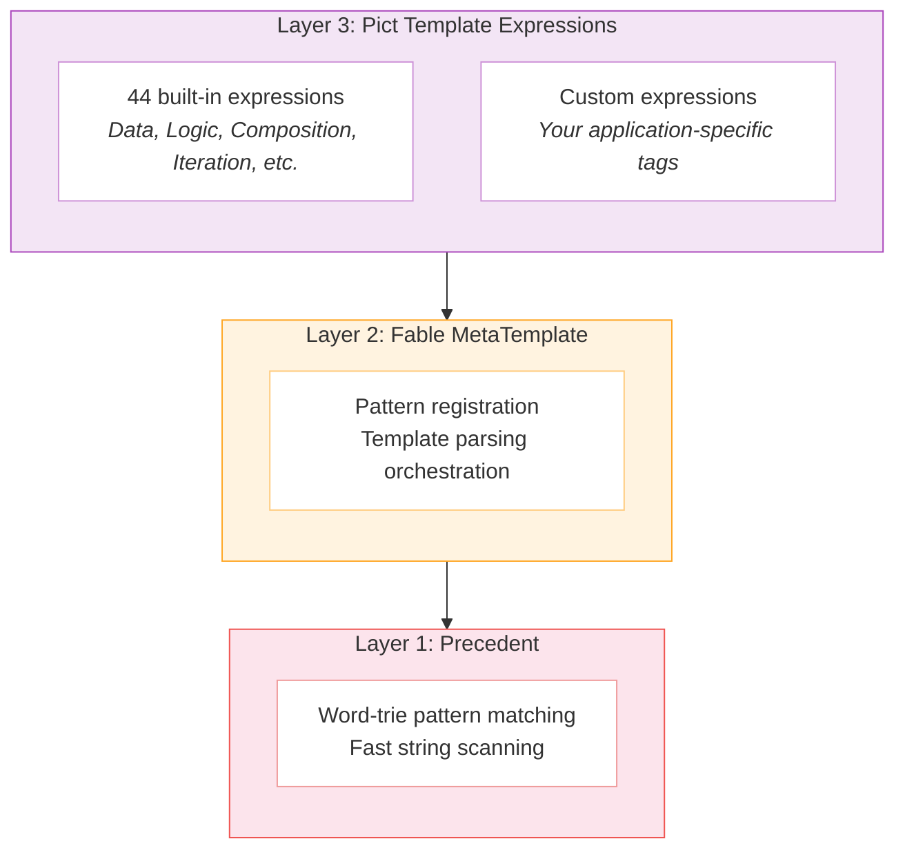
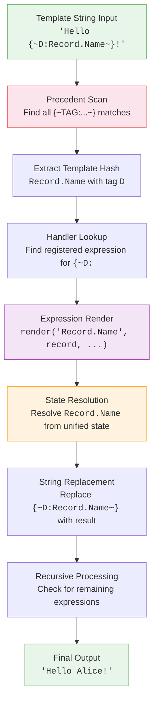

# Jellyfish Deep Dive

This document covers the internals of the Jellyfish template engine -- how templates are parsed, how expressions are resolved, and how the rendering pipeline works from string input to final output.

## Three-Layer Architecture

Jellyfish is built from three distinct layers, each responsible for a different part of template processing.



### Layer 1: Precedent

[Precedent](#/doc/utility/precedent) is a word-trie-based pattern matcher. It scans strings for registered start/end delimiter pairs and extracts the content between them. The trie structure makes this efficient even for long template strings with many registered patterns.

When you register `{~D:` as a start pattern and `~}` as an end pattern, Precedent builds a trie that recognizes this pair anywhere in a string. Given the input `Hello {~D:Record.Name~}!`, Precedent identifies the match and extracts `Record.Name` as the content between delimiters.

### Layer 2: Fable MetaTemplate

The MetaTemplate service wraps Precedent and manages the connection between pattern matches and their handlers. It lives in Fable (not Pict), which means the basic template engine is available to any Fable-based application.

MetaTemplate provides two key methods:

- `addPatternBoth(startTag, endTag, renderSync, renderAsync, context)` -- Registers a delimiter pair with both sync and async render functions.
- `parseString(templateString, data, callback, contextArray, scope, state)` -- Processes a template string, finding all matches and calling their registered handlers.

### Layer 3: Pict Template Expressions

Each expression is a class extending `pict-template` (which extends `fable-serviceproviderbase`). An expression registers its delimiter patterns in its constructor and implements `render()` and optionally `renderAsync()`.

```javascript
class MyExpression extends libPictTemplate
{
	constructor(pFable, pOptions, pServiceHash)
	{
		super(pFable, pOptions, pServiceHash);
		this.addPattern('{~MyTag:', '~}');
	}

	render(pTemplateHash, pRecord, pContextArray, pScope, pState)
	{
		// pTemplateHash is the content between {~MyTag: and ~}
		return 'result string';
	}
}
```

## The Rendering Pipeline

When you call `pict.parseTemplate(templateString, record)`, the following sequence occurs:



The recursive step is important. Template expressions can return strings that themselves contain template expressions. For example, `{~T:SomeTemplate~}` returns the content of `SomeTemplate`, which may contain `{~D:...~}` expressions that need further resolution. The engine continues processing until no more expressions remain.

## State Resolution

Every template expression has access to `resolveStateFromAddress()`, which resolves a dot-notation address against Pict's unified state object.

The unified state combines several namespaces into a single object:

```javascript
{
	Fable: pict,              // The Fable/Pict instance
	Pict: pict,               // Alias for the same instance
	AppData: pict.AppData,    // Persistent application state
	TempData: pict.TempData,  // Transient caches
	Bundle: pict.Bundle,      // Configuration and supporting data
	Context: pContextArray,   // Hierarchical context array
	Record: pRecord,          // Current record (loop item or passed data)
	Scope: pScope,            // Sticky scope for carrying state
	__State: pState           // Internal plumbing
}
```

Address resolution uses [Manyfest](#/doc/utility/manyfest) for safe traversal. A path like `AppData.Users[0].Name` navigates the nested structure without throwing if any intermediate key is missing.

### Namespace Roles

**AppData** is the primary state container. Application code sets values here, and templates read them. It persists for the lifetime of the Pict instance.

```javascript
_Pict.AppData.User = { Name: 'Alice', Role: 'admin' };
_Pict.parseTemplate('{~D:AppData.User.Name~}');
// 'Alice'
```

**Record** is the context-specific data object. In a template set (`{~TS:...~}`), Record is the current item being iterated. When calling `parseTemplate` directly, the second argument becomes Record.

```javascript
_Pict.parseTemplate('{~D:Record.Title~}', { Title: 'Dune' });
// 'Dune'
```

**Bundle** holds configuration and supporting data that supplements AppData. Typically set during initialization.

**TempData** is for values that do not need to persist -- intermediate calculations, caches, or per-render scratch data.

**Context** is an array of objects accessible by index. It provides hierarchical context when templates are deeply nested.

**Scope** is a sticky state container that travels through template processing. A parent template can set scope values that child templates access. The `{~VRS:ViewHash~}` expression (View Retaining Scope) uses this to pass state into view rendering.

## Synchronous vs Asynchronous Rendering

Most expressions are synchronous -- they resolve data from memory and return a string immediately. The Data expression, formatting expressions, logic expressions, and solvers are all synchronous.

Some expressions require asynchronous work. The Entity expression (`{~E:...~}`) fetches records from a REST API. View expressions may trigger async rendering pipelines.

The engine handles both modes:

```javascript
// Synchronous -- no callback, returns string
let tmpResult = _Pict.parseTemplate('{~D:AppData.Title~}');

// Asynchronous -- callback receives the result
_Pict.parseTemplate('{~E:Book^42^BookCard~}', {},
	(pError, pResult) =>
	{
		console.log(pResult);
	});
```

When a template contains a mix of sync and async expressions, the engine processes synchronous expressions immediately and queues async expressions. The callback fires when all async operations complete.

Every expression class defines both `render()` (sync) and `renderAsync()` (async). The base class default for `renderAsync` simply calls `render` and passes the result to the callback. Expressions that need true async behavior override `renderAsync`.

## Template Registration and Storage

Named templates are stored in the **TemplateProvider** -- a service that maps string hashes to template content.

```javascript
// Store a template
_Pict.TemplateProvider.addTemplate('BookCard',
	'<div>{~D:Record.Title~}</div>');

// Retrieve it
let tmpTemplate = _Pict.TemplateProvider.getTemplate('BookCard');
// '<div>{~D:Record.Title~}</div>'
```

Templates can also be registered through view configurations, where the `Templates` array in a view's config is automatically loaded into the TemplateProvider.

### Default Templates

The TemplateProvider supports **default templates** -- patterns that match template hashes by prefix and postfix. This enables convention-based rendering without registering every template explicitly.

```javascript
// Register a default template matching any hash ending in '-ListRow'
_Pict.TemplateProvider.addDefaultTemplate('', '-ListRow',
	'<li>{~D:Record.Name~}</li>');

// Now both of these resolve to the default:
_Pict.parseTemplate('{~TS:Product-ListRow:AppData.Products~}');
_Pict.parseTemplate('{~TS:User-ListRow:AppData.Users~}');
```

The TemplateProvider looks for an exact match first. If none is found, it checks default templates for a matching prefix/postfix pattern.

## Parameter Conventions

Template expressions use two separator conventions:

- **Colon (`:`)** separates major parameters. For example, `{~T:TemplateHash:DataAddress~}` has two colon-separated parameters.
- **Caret (`^`)** separates sub-parameters within a single parameter. For example, `{~TIf:Template:Data:Left^==^Right~}` has a condition parameter with three caret-separated parts.

This distinction matters when parsing expression hashes. A TemplateIf expression receives `Template:Data:Left^==^Right` as its hash, splits on colons to get the three major parameters, then splits the third parameter on carets to get the comparison operands and operator.

## Nesting and Recursion

Templates can nest arbitrarily deep. A Template expression renders another template, which may contain TemplateSet expressions, which render templates that contain Data expressions, and so on.

```javascript
_Pict.TemplateProvider.addTemplate('Page',
	'<main>{~T:Header~}{~TS:Section:AppData.Sections~}{~T:Footer~}</main>');

_Pict.TemplateProvider.addTemplate('Header',
	'<header><h1>{~D:AppData.Title~}</h1></header>');

_Pict.TemplateProvider.addTemplate('Section',
	'<section><h2>{~D:Record.Heading~}</h2><p>{~D:Record.Body~}</p></section>');

_Pict.TemplateProvider.addTemplate('Footer',
	'<footer>{~D:AppData.Copyright~}</footer>');
```

Rendering `Page` triggers a cascade: the engine processes the Template expressions, which return content containing Data expressions, which are then resolved. Each level sees the same unified state but with the appropriate Record for the current iteration context.

## Expression Lifecycle

When Pict initializes, it calls `initializePictTemplateEngine()` which registers all 44 built-in expressions. Each expression:

1. Is instantiated as a Fable service
2. Registers its delimiter patterns with MetaTemplate (via `addPattern`)
3. Becomes available for immediate use in any template string

Custom expressions follow the same lifecycle. Calling `_Pict.addTemplate(ExpressionClass)` instantiates the class and registers its patterns.

The order of registration does not matter. Precedent's trie handles overlapping patterns correctly -- `{~D:` and `{~DJ:` and `{~DWTF:` all coexist because the trie matches the longest applicable start pattern.

## Error Handling

Jellyfish templates fail gracefully. The design principle is that a template should always produce output, even if some expressions cannot resolve.

- **Missing data:** Returns empty string. `{~D:AppData.Missing.Path~}` produces `''`.
- **Invalid template hash:** Logs a warning and returns empty string.
- **Missing named template:** The Template expression logs a warning and returns empty string.
- **Type mismatches:** Formatting expressions handle non-numeric input gracefully, typically returning the input unchanged or empty string.
- **Async errors:** Passed to the callback's error parameter without crashing the rendering pipeline.

This means a partially-populated data model still produces usable output. Missing values appear as empty strings rather than error messages or exceptions.

## Performance Considerations

Precedent's word-trie makes pattern scanning efficient. The trie is built once when patterns are registered and reused for every parse operation.

Template strings are not pre-compiled or cached by default. Each call to `parseTemplate` scans the string fresh. For templates rendered repeatedly with different data (like inside a TemplateSet), the named template system avoids string duplication -- the TemplateProvider stores each template once and the engine references it by hash.

For high-frequency rendering scenarios, the key optimization is keeping template strings short and using composition (`{~T:...~}`) to break large templates into smaller, focused pieces. This also improves readability and maintainability.
