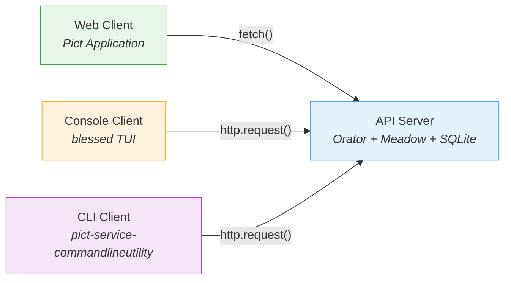

# Examples

The `examples/` directory contains complete, runnable applications that demonstrate how Retold modules work together. Each example is self-contained with its own `package.json` and README.

## Quickstart Layers

**Location:** `examples/quickstart/`

A five-step progression that builds up the Retold stack one layer at a time, from a bare Fable instance to a full API with a Pict browser UI. Each layer adds one concept and is referenced from the [Getting Started](../getting-started.md) guide.

| Layer | What it adds |
|-------|-------------|
| Layer 1 | Fable -- configuration, logging, dependency injection |
| Layer 2 | Meadow -- define a data entity and connect to a database |
| Layer 3 | Orator -- serve the entity over HTTP |
| Layer 4 | Meadow-Endpoints -- auto-generate the full REST API |
| Layer 5 | Pict + Manyfest -- add a browser UI and schema-driven data access |

## Todo List Application

**Location:** `examples/todo-list/`

A complete full-stack application with four separate clients that all connect to the same REST API and SQLite database. This is the most comprehensive example in the repository and demonstrates nearly every major Retold pattern.

**Detailed documentation:**

- **[Todo List Application](todolist/todo-list.md)** -- Architecture overview and quickstart
- **[Data Model](todolist/todo-list-model.md)** -- Stricture MicroDDL, Meadow schema, seed data
- **[API Server](todolist/todo-list-server.md)** -- Orator + Meadow + SQLite wiring
- **[Web Client](todolist/todo-list-web-client.md)** -- Pict Application with views, providers, and routing
- **[Console Client](todolist/todo-list-console-client.md)** -- blessed TUI with pict-terminalui
- **[CLI Client](todolist/todo-list-cli-client.md)** -- Non-interactive command-line tool

### Retold Patterns Demonstrated

| Pattern | Where |
|---------|-------|
| Fable service provider | All components |
| Stricture MicroDDL schema | `model/Task.mddl` |
| Meadow DAL + SQLite | API server |
| Meadow Endpoints (auto REST) | API server |
| Orator HTTP server | API server |
| CSV seeding through Meadow DAL | API server |
| Pict Application lifecycle | Web client |
| Pict Views + Templates | Web client |
| Pict Providers | Web client |
| Pict Router (hash routing) | Web client |
| View CSS injection | Web client |
| Quackage build system | Web client |
| pict-terminalui + blessed | Console client |
| ContentAssignment override | Console client |
| pict-service-commandlineutility | CLI client |
| Command-per-folder pattern | CLI client |
| Fable custom service | CLI client |
