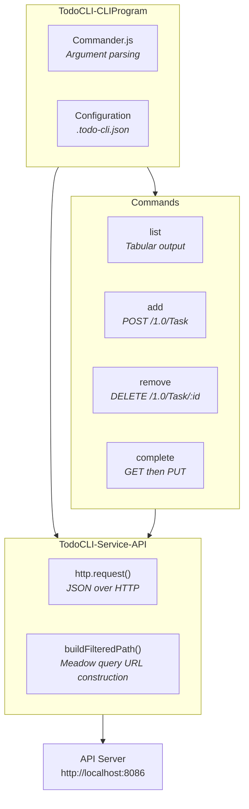

# Todo List: CLI Client

> Part of the [Todo List Application](todo-list.md) example.
>
> **Source:** [`examples/todo-list/cli-client/`](../examples/todo-list/cli-client/)

The CLI client is a non-interactive command-line tool built on pict-service-commandlineutility. It demonstrates the command-per-folder pattern used by Quackage and other Retold CLI tools: each command lives in its own folder, shares a common API service, and registers itself with the Commander.js-based framework.

## Running

```bash
cd examples/todo-list/cli-client
npm install
npx todo --help
```

The server must be running on port 8086 (or configure a different URL in `.todo-cli.json`).

### Running with Docker

From the `examples/todo-list/` directory, run `./docker-shell.sh` for an interactive shell inside the container. Start the server in the background, then use the CLI:

```bash
node server/server.cjs &
cd /app/cli-client && npx todo list
```

See the [main quickstart](todo-list.md#running-with-docker) for details.

## Commands

### `todo list`

List tasks with optional search, sort, and filter.

```bash
npx todo list                                   # Default: newest first, up to 50
npx todo list --search garden --limit 10        # Search name + description
npx todo list --column Name --direction ASC     # Sort alphabetically
npx todo list --status Pending                  # Client-side status filter
```

| Option | Description | Default |
|--------|-------------|---------|
| `-s, --search [text]` | LIKE search across Name and Description | (none) |
| `-c, --column [column]` | Sort column: DueDate, Name, Status, LengthInHours, IDTask | DueDate |
| `-d, --direction [dir]` | Sort direction: ASC or DESC | DESC |
| `-n, --limit [count]` | Maximum records to return | 50 |
| `--status [status]` | Client-side filter by status (Pending, In Progress, Complete) | (none) |

**Aliases:** `ls`, `l`

### `todo add`

Create a new task.

```bash
npx todo add "Water the plants" --due 2026-03-15 --hours 0.5
npx todo add "Team standup" --status "In Progress" --description "Daily 9am sync"
```

| Option | Description | Default |
|--------|-------------|---------|
| `-D, --description [text]` | Task description | (empty) |
| `-d, --due [date]` | Due date (YYYY-MM-DD) | (empty) |
| `-h, --hours [hours]` | Estimated hours | 0 |
| `-s, --status [status]` | Initial status | Pending |

**Aliases:** `new`, `create`

### `todo complete`

Mark a task as complete by ID. Fetches the task first and skips if already complete.

```bash
npx todo complete 42
```

**Aliases:** `done`, `finish`

### `todo remove`

Delete a task by ID.

```bash
npx todo remove 42
```

**Aliases:** `rm`, `delete`, `del`

### `todo explain-config`

Built-in command from pict-service-commandlineutility. Shows the resolved configuration after merging defaults with any `.todo-cli.json` files found in the home directory or current working directory.

## Architecture



### Command-per-folder Pattern

Each command lives in its own folder under `source/commands/`:

```
source/commands/
    list/       TodoCLI-Command-List.js
    add/        TodoCLI-Command-Add.js
    remove/     TodoCLI-Command-Remove.js
    complete/   TodoCLI-Command-Complete.js
```

This is the same pattern used by Quackage and other Retold CLI tools. Each command file exports a class that extends `ServiceCommandLineCommand`, sets its keyword, description, arguments, and options in the constructor, and implements `onRunAsync(fCallback)` for the command logic.

### Shared API Service

`TodoCLI-Service-API.js` extends `fable-serviceproviderbase` and provides two methods used by all commands:

- **`request(method, path, body, callback)`** -- makes an HTTP request to the API server, parses the JSON response, and returns it through the callback
- **`buildFilteredPath(sortColumn, sortDirection, searchText, limit)`** -- constructs a Meadow FilteredTo URL with sort stanzas and optional LIKE search filters (with `%` wildcards)

The service reads its base URL from `this.fable.settings.ApiBaseURL`, which defaults to `http://localhost:8086` and can be overridden in `.todo-cli.json`.

### Bootstrap

`TodoCLI-CLIProgram.js` creates a `pict-service-commandlineutility` instance with settings and an array of command class prototypes. The framework iterates the array, instantiates each command, and registers it with Commander.js. The `TodoAPI` service is registered separately using `addAndInstantiateServiceType`.

`TodoCLI-Run.js` is the shebang entry point (`#!/usr/bin/env node`) that requires the program module and calls `.run()`.

### Configuration

The framework automatically searches for `.todo-cli.json` in the user's home directory and the current working directory. Configuration from all sources is merged in order (defaults, home, CWD). The only setting is the API base URL:

```json
{
    "ApiBaseURL": "http://localhost:8086"
}
```

## Dependencies

| Module | Role |
|--------|------|
| `pict-service-commandlineutility` | CLI framework (Commander.js + Fable service container) |
| `fable-serviceproviderbase` | Base class for the API service (transitive dependency) |

## Files

| File | Purpose |
|------|---------|
| `source/TodoCLI-Run.js` | Shebang entry point for the `todo` bin command |
| `source/TodoCLI-CLIProgram.js` | Bootstrap -- registers commands and the API service |
| `source/services/TodoCLI-Service-API.js` | Shared HTTP client with JSON parsing and FilteredTo URL builder |
| `source/commands/list/TodoCLI-Command-List.js` | `todo list` -- tabular output with search, sort, filter, limit |
| `source/commands/add/TodoCLI-Command-Add.js` | `todo add <name>` -- create a task with options |
| `source/commands/remove/TodoCLI-Command-Remove.js` | `todo remove <id>` -- delete a task |
| `source/commands/complete/TodoCLI-Command-Complete.js` | `todo complete <id>` -- mark a task as complete |
