# Todo List: Console Client

> Part of the [Todo List Application](todo-list.md) example.
>
> **Source:** [`examples/todo-list/console-client/`](../examples/todo-list/console-client/)

The console client is a full-screen terminal UI built on blessed, bridged to Pict views through pict-terminalui. It demonstrates how the same Pict view/template architecture that drives the browser UI can render into a terminal -- views write templates, and the ContentAssignment bridge sends the output to blessed widgets instead of the DOM.

## Running

```bash
cd examples/todo-list/console-client
npm install
npm start
```

The server must be running on port 8086.

### Running with Docker

From the `examples/todo-list/` directory, run `./docker-shell.sh` for an interactive shell inside the container. Start the server in the background, then launch the console client:

```bash
node server/server.cjs &
node console-client/console-client.cjs
```

See the [main quickstart](todo-list.md#running-with-docker) for details.

## Keyboard Controls

| Key | Action |
|-----|--------|
| Up / Down | Navigate task selection |
| Enter | View selected task (read-only detail) |
| E | Edit selected task |
| A | Add a new task |
| D | Delete selected task |
| S | Open sort picker (10 sort options) |
| / | Search by name or description |
| R | Refresh from server |
| Q | Quit |

## Architecture

```mermaid
graph TB
    subgraph app["TodoListConsoleApplication"]
        state["AppData.TodoList<br/><i>Tasks, SelectedIndex, ListState</i>"]
        http["httpRequest()<br/><i>Node.js http module</i>"]
        modals["Modal dialogs<br/><i>View, Edit, Sort, Search</i>"]
    end

    subgraph tui["pict-terminalui"]
        bridge["ContentAssignment bridge<br/><i>Pict views → blessed widgets</i>"]
    end

    subgraph blessed["blessed screen"]
        header["TUI-Header<br/><i>Title + keybindings</i>"]
        content["TUI-TaskList<br/><i>Scrollable task rows</i>"]
        status["TUI-StatusBar<br/><i>Count, sort, message</i>"]
    end

    app --> tui
    tui --> blessed
    http -- "GET/POST/PUT/DELETE" --> server["API Server"]
```



## How It Works

The console client is a single `console-client.cjs` file that extends `pict-application`. On initialization it:

1. **Creates a blessed screen** -- the terminal canvas managed by blessed
2. **Builds the widget layout** -- header, content area, and status bar as blessed boxes
3. **Registers widgets with pict-terminalui** -- the bridge maps CSS-style selectors (`#TUI-Header`, `#TUI-Content`, `#TUI-StatusBar`) to blessed widgets
4. **Binds keyboard handlers** -- each key checks a `_modalOpen` flag to prevent conflicts between the main list and modal dialogs
5. **Loads tasks** via HTTP and renders the initial view

### pict-terminalui Bridge

The key architectural pattern is the ContentAssignment override. In a browser, Pict views render templates and write the result into DOM elements using `innerHTML`. The pict-terminalui module replaces this mechanism: when a view writes to `#TUI-Content`, the bridge sends the text to the corresponding blessed widget's `setContent()` method instead.

This means the four TUI view classes (`PictView-TUI-Layout`, `PictView-TUI-Header`, `PictView-TUI-TaskList`, `PictView-TUI-StatusBar`) use standard Pict templates with `{~Data:...~}` expressions. They don't know they're rendering into a terminal.

### Modal System

The console client has four modal dialogs, each created as a temporary blessed widget that overlays the main screen:

- **View modal** (Enter) -- a `blessed.box` showing read-only task detail (name, status, due date, hours, description). Press Esc to close or E to jump to edit.
- **Edit modal** (E) -- a sequential chain of `blessed.prompt` dialogs for each field (Name, Description, DueDate, LengthInHours, Status). Pressing Escape at any point cancels the edit.
- **Sort modal** (S) -- a `blessed.list` with 10 sort options (DueDate, Name, Status, Hours, IDTask in both ASC and DESC). The current sort is pre-selected. Choosing an option reloads the task list from the API.
- **Search modal** (/) -- a `blessed.prompt` for entering a search string. The search filters across both Name and Description using a LIKE query with OR. An empty string clears the filter.

All modals set a `_modalOpen` flag on open and clear it on close. Every keyboard handler checks this flag before acting, preventing key conflicts (e.g., pressing Q in a modal closes the modal, not the application).

### HTTP Communication

The client uses Node.js `http.request()` with a simple wrapper function. The `_buildFilteredPath()` method constructs the same Meadow FilteredTo URL syntax that the web client uses, including `%` wildcards for LIKE searches:

```javascript
let tmpSearchEncoded = encodeURIComponent('%' + tmpState.SearchText + '%');
tmpFilter = 'FBV~Name~LK~' + tmpSearchEncoded
    + '~FBVOR~Description~LK~' + tmpSearchEncoded
    + '~' + tmpFilter;
```

## Views

### PictView-TUI-Layout

Root container that triggers renders of the header, content, and status bar child views. Registered to `#TUI-Application-Container`.

### PictView-TUI-Header

Renders the application title and keybinding reference bar into the top blessed box:

```
Todo List Console Client
[Enter]View  [E]dit  [A]dd  [D]elete  [S]ort  [/]Search  [R]efresh  [Q]uit
```

### PictView-TUI-TaskList

Builds a formatted text table from `AppData.TodoList.Tasks` with columns for index, name, status, due date, and hours. The currently selected row is highlighted with `{inverse}` blessed tags.

### PictView-TUI-StatusBar

Shows the task count, status message, and current sort column/direction using a Pict template:

```
Tasks: {~D:Record.Tasks.length~} | {~D:Record.StatusMessage~} | Sort: {~D:Record.ListState.SortColumn~} {~D:Record.ListState.SortDirection~}
```

## Dependencies

| Module | Role |
|--------|------|
| `blessed` | Terminal UI rendering (boxes, lists, prompts, key handling) |
| `pict` | Core view and template engine |
| `pict-application` | Application lifecycle |
| `pict-view` | View base class |
| `pict-terminalui` | ContentAssignment bridge from Pict views to blessed widgets |

## Files

| File | Purpose |
|------|---------|
| `console-client.cjs` | Application class -- screen setup, keyboard bindings, modals, HTTP client |
| `views/PictView-TUI-Layout.cjs` | Root blessed layout (header + content + status bar) |
| `views/PictView-TUI-Header.cjs` | Title bar with keybinding reference |
| `views/PictView-TUI-TaskList.cjs` | Scrollable task list with selection highlighting |
| `views/PictView-TUI-StatusBar.cjs` | Status line showing count, message, and current sort |
