# Todo List: API Server

> Part of the [Todo List Application](examples/todolist/todo-list.md) example.
>
> **Source:** [`examples/todo-list/server/`](../examples/todo-list/server/)

The server demonstrates the standard Retold API assembly: Fable for dependency injection, Meadow for data access, Meadow Endpoints for automatic REST route generation, and Orator for the HTTP server. It also shows how to create a custom Fable service for database initialization and CSV seeding.

## Running

```bash
cd examples/todo-list/server
npm install
npm start
```

The server starts on **http://localhost:8086** and serves both the REST API and the web client's static files.

### Running with Docker

From the `examples/todo-list/` directory, run `./docker-run.sh` to build the Docker image and start the server. The web client is pre-built inside the image, so you can open **http://localhost:8086** immediately. See the [main quickstart](examples/todolist/todo-list.md) for details on the interactive shell.

## How It Works

```mermaid
graph TB
    subgraph startup["Startup Sequence"]
        direction TB
        s1["1. Create Fable instance<br/><i>Settings, logging, SQLite config</i>"]
        s2["2. Register service types<br/><i>Orator, SQLite provider, DB init service</i>"]
        s3["3. Connect database<br/><i>Open or create todo.sqlite</i>"]
        s4["4. Create tables<br/><i>From compiled Stricture DDL</i>"]
        s5["5. Seed data<br/><i>CSV → Meadow doCreate (if empty)</i>"]
        s6["6. Create Meadow DAL<br/><i>Task entity with schema</i>"]
        s7["7. Create Meadow Endpoints<br/><i>Auto-generate REST routes</i>"]
        s8["8. Start Orator<br/><i>HTTP server + static files</i>"]

        s1 --> s2 --> s3 --> s4 --> s5 --> s6 --> s7 --> s8
    end
```



The server file (`server.cjs`) is intentionally thin. Most of the behavior comes from Retold modules -- the server's job is to wire them together in the right order.

### Step 1-2: Fable and Service Registration

A Fable instance is created with settings for the product name, API port, and SQLite file path. Service types are registered for the HTTP server (Orator + Restify), the SQLite connection provider, and the custom database initialization service.

### Step 3-5: Database Setup

The `DatabaseInitializationService` is a custom Fable service (extending `fable-serviceproviderbase`) that handles three tasks:

1. **Connect** -- Ensures the `data/` directory exists and opens the SQLite file through `meadow-connection-sqlite`
2. **Create tables** -- Passes the compiled Stricture model to the provider's `createTables()` method, which generates SQLite DDL
3. **Seed data** -- Checks if the table is empty; if so, reads the CSV file, parses it, and inserts each row through the Meadow DAL using `doCreate()` queued with Fable's Anticipate service

Because seeding goes through the Meadow DAL, every record gets automatic GUID generation, audit timestamps, and default values.

### Step 6-7: Entity and Endpoints

A Meadow DAL instance is created for the Task entity, configured with the schema from `MeadowSchema-Task.json`. Meadow Endpoints then wraps this DAL to generate the full REST API automatically.

### Step 8: HTTP Server

Orator initializes with Restify, connects the auto-generated endpoints, adds a static file route pointing to `../web-client/dist/`, and starts listening.

## API Endpoints

Meadow Endpoints auto-generates these routes from the Task entity:

| Method | Endpoint | Description |
|--------|----------|-------------|
| GET | `/1.0/Tasks/{Begin}/{Cap}` | List tasks with pagination |
| GET | `/1.0/Tasks/FilteredTo/{Filter}/{Begin}/{Cap}` | List with sort, search, filter |
| GET | `/1.0/Task/{IDTask}` | Read a single task |
| POST | `/1.0/Task` | Create a task |
| PUT | `/1.0/Task` | Update a task |
| DELETE | `/1.0/Task/{IDTask}` | Soft-delete a task |
| GET | `/1.0/Tasks/Count` | Total record count |
| GET | `/1.0/Tasks/Count/FilteredTo/{Filter}` | Filtered record count |

### FilteredTo Query Syntax

The FilteredTo URL segment accepts tilde-delimited filter stanzas that the server parses into SQL through FoxHound. This is how all three clients request sorted, filtered, and paginated data.

**Sort stanza:**

```
FSF~{Column}~{Direction}~0
```

Example: `FSF~DueDate~DESC~0` sorts by DueDate descending.

**Filter stanzas:**

```
FBV~{Column}~{Operator}~{Value}       (AND)
FBVOR~{Column}~{Operator}~{Value}     (OR)
```

Common operators: `EQ` (equals), `LK` (LIKE), `GT` (greater than), `LT` (less than), `IN` (IS NULL), `NN` (IS NOT NULL).

**Combined example:**

```
/1.0/Tasks/FilteredTo/FBV~Name~LK~%25garden%25~FBVOR~Description~LK~%25garden%25~FSF~DueDate~DESC~0/0/50
```

This searches for tasks where Name or Description contains "garden", sorted by DueDate descending, returning the first 50 results. The `%25` is the URL-encoded `%` wildcard for the LIKE operator.

## Dependencies

| Module | Role |
|--------|------|
| `fable` | Dependency injection, configuration, logging |
| `orator` | HTTP server abstraction |
| `orator-serviceserver-restify` | Restify implementation for Orator |
| `meadow` | Data access layer (ORM) |
| `meadow-endpoints` | Auto-generated REST routes |
| `meadow-connection-sqlite` | SQLite connection provider |
| `fable-serviceproviderbase` | Base class for DatabaseInitializationService |

## Files

| File | Purpose |
|------|---------|
| `server.cjs` | Main entry point -- wires Fable, Orator, Meadow, and SQLite together |
| `database-initialization-service.cjs` | Custom Fable service for table creation and CSV seeding |
| `data/todo.sqlite` | SQLite database file (auto-created on first run) |
