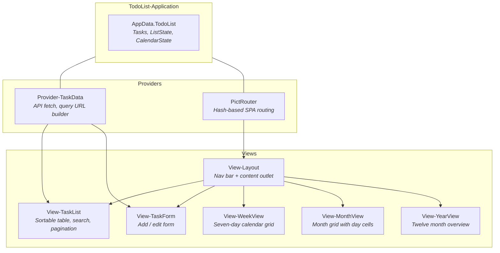

# Todo List: Web Client

> Part of the [Todo List Application](todo-list.md) example.
>
> **Source:** [`examples/todo-list/web-client/`](../examples/todo-list/web-client/)

The web client is a browser-based Pict Application with hash routing, data providers, and six views. It demonstrates the standard Pict patterns for building a single-page application: views render templates into DOM containers, a provider manages API communication, and the application class coordinates lifecycle and shared state.

## Running

```bash
cd examples/todo-list/web-client
npm install
npm run build
```

Then open **http://localhost:8086** in a browser (the API server serves the built files).

The build step uses Quackage to browserify the application source into `dist/`, then copies the HTML shell and CSS theme alongside it.

### Running with Docker

From the `examples/todo-list/` directory, run `./docker-run.sh` to build the Docker image and start the server. The web client is already built inside the image -- just open **http://localhost:8086** in a browser. See the [main quickstart](todo-list.md#running-with-docker) for more options.

## Application Structure



## Application Class

`TodoList-Application.cjs` extends `pict-application` and is the central coordinator. In its constructor it registers all views, the data provider, and the router. In `onAfterInitializeAsync` it initializes the shared state object (`AppData.TodoList`) and triggers the first data load.

The shared state holds:

- **Tasks** -- the current page of task records from the API
- **ListState** -- sort column, sort direction, search text, pagination bounds
- **CalendarState** -- anchor date and pre-computed row data for week/month/year views

The application class also provides action methods called from view templates: `addTask()`, `editTask(id)`, `deleteTask(id)`, `saveTask()`, `changeSortOrder(value)`, `searchTasks()`, `clearSearch()`, `showCalendarView(id)`, `calendarNavigate(unit, delta)`, and `calendarToday(unit)`.

## Data Provider

`Provider-TaskData.cjs` extends `pict-provider` and encapsulates all API communication. Its key methods:

- **`buildReadsURL()`** -- constructs a Meadow FilteredTo URL from the current ListState (sort, search, pagination). This is where the FBV/FBVOR/FSF filter stanzas are assembled.
- **`loadTasks(callback)`** -- fetches the task list, total count, and (when searching) filtered count in a single `Promise.all` batch
- **`loadAllTasks(callback)`** -- fetches every task sorted by date for the calendar views
- **`createTask(data, callback)`** -- POST to `/1.0/Task`
- **`updateTask(data, callback)`** -- PUT to `/1.0/Task`
- **`deleteTask(id, callback)`** -- DELETE to `/1.0/Task/:id`

## Routing

`Router-Config.json` defines the hash routes:

| Route | View | Description |
|-------|------|-------------|
| `/TaskList` | TodoList-TaskList | Task list (default) |
| `/TaskForm` | TodoList-TaskForm | New task form |
| `/TaskForm/:id` | TodoList-TaskForm | Edit task form |
| `/WeekView` | TodoList-WeekView | Week calendar |
| `/MonthView` | TodoList-MonthView | Month calendar |
| `/YearView` | TodoList-YearView | Year calendar |

Navigation links in the layout view set `window.location.hash`, which the Pict Router picks up and renders the corresponding view into the content outlet.

## Views

### View-Layout

The root container. Renders a navigation bar with links to the task list and calendar views, plus a `#TodoList-Content` div that child views render into. The nav bar uses the Sagebrush color theme.

View-specific CSS: nav bar styling only (background, link colors, separator).

### View-TaskList

The main task list with:

- A toolbar with search input, sort dropdown, record count display, and add button
- A data table with Name, Due Date, Hours, Status, and Actions columns
- Per-row Edit and Delete action buttons
- Status badges color-coded by task state
- TemplateSet iteration (`{~Each:...~}`) to render rows from the Tasks array

View-specific CSS: button sizing overrides for toolbar and action columns.

### View-TaskForm

A form for creating and editing tasks. Fields: Name, Description, DueDate (date picker), LengthInHours, Status (dropdown). The form reads from `AppData.TodoList.SelectedTask` and calls `saveTask()` on submit.

### View-WeekView

A seven-day calendar grid anchored to the current week. Shows task counts per day with navigation buttons (previous/next week, today). All calendar views use `AppData.TodoList.AllTasks` and compute their display data client-side from the full task set.

### View-MonthView

A full month grid with 7 columns (Sun-Sat). Each day cell shows the number of complete and open tasks. Days outside the current month are dimmed.

View-specific CSS: month grid layout, cell styling, day number positioning.

### View-YearView

Twelve month cards arranged in a 4x3 grid, each showing the task count for that month. Below the grid, a summary table lists statistics. The current month is highlighted.

View-specific CSS: year grid layout, card styling, current-month border.

## CSS Architecture

Shared styles live in `css/todolist-theme.css` -- a plain CSS file loaded via `<link>` in `index.html` and copied to `dist/css/` by the build. This file contains the Sagebrush color theme, base typography, buttons, table styling, form styling, status badges, and shared calendar styles.

View-specific styles stay in each view's configuration as inline `/*css*/` tagged template strings. Pict injects these into the page when the view renders. Only styles unique to a single view live here -- anything shared goes in the theme file.

## Build System

The web client uses Quackage (the Retold build tool) to bundle and copy files:

- `npm run build` runs `npx quack build && npx quack copy`
- Quackage reads `.gulpfile-quackage-config.json` for the browserify entry point and output path
- The `copyFiles` array in `package.json` maps `html/*` and `css/*` to `dist/`, and copies `pict.min.js` from `node_modules`

## Dependencies

| Module | Role |
|--------|------|
| `pict` | Core view and template engine |
| `pict-application` | Application lifecycle and service container |
| `pict-view` | View base class |
| `pict-provider` | Data provider base class |
| `pict-router` | Hash-based client-side routing |
| `quackage` (dev) | Build tool (Gulp wrapper for browserify + copy) |

## Files

| File | Purpose |
|------|---------|
| `source/TodoList-Application.cjs` | Application class -- registers views, providers, router; manages shared state |
| `source/TodoList-Application-Config.json` | Pict application settings (main viewport, auto-solve, lazy render) |
| `source/providers/Provider-TaskData.cjs` | Data provider -- API fetch, FilteredTo URL builder, CRUD methods |
| `source/providers/Router-Config.json` | Route table mapping hash paths to views |
| `source/views/View-Layout.cjs` | Root layout with navigation bar and content outlet |
| `source/views/View-TaskList.cjs` | Paginated task table with search, sort, and inline actions |
| `source/views/View-TaskForm.cjs` | Create / edit form |
| `source/views/calendar/View-WeekView.cjs` | Week calendar grid |
| `source/views/calendar/View-MonthView.cjs` | Month calendar grid |
| `source/views/calendar/View-YearView.cjs` | Year overview with month cards |
| `css/todolist-theme.css` | Shared Sagebrush theme stylesheet |
| `html/index.html` | HTML shell -- loads Pict, the app bundle, and the theme CSS |
