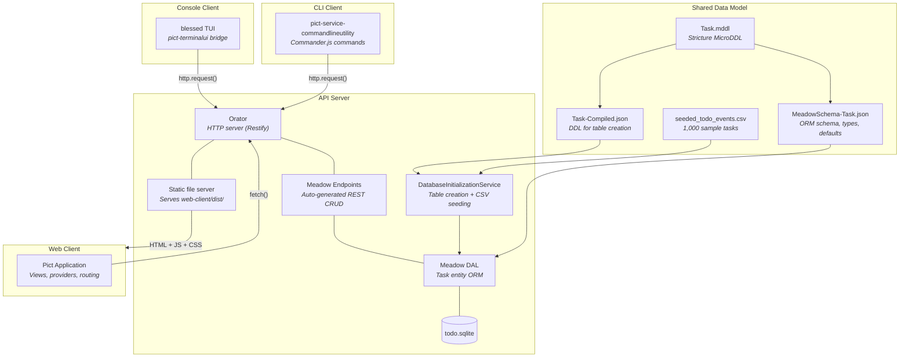

# Todo List Application

A complete full-stack example demonstrating the Retold module suite. A single REST API server backed by SQLite is consumed by three separate clients: a browser-based Pict application, a terminal UI built on blessed, and a non-interactive command-line tool.

> **Source:** [`examples/todo-list/`](../examples/todo-list/)

## Architecture



All four components share a single [Task data model](examples/todolist/todo-list-model.md) defined in Stricture MicroDDL. The server creates the SQLite table from the compiled DDL, seeds it with sample data through the Meadow DAL, and auto-generates REST endpoints with Meadow Endpoints. Each client speaks to the server over HTTP using the same query DSL for sorting, filtering, and pagination.

## Quickstart

### Prerequisites

- Node.js 18+

### 1. Start the API Server

```bash
cd examples/todo-list/server
npm install
npm start
```

The server starts on **http://localhost:8086**. On first run it creates a SQLite database, builds the Task table from compiled Stricture DDL, and seeds 1,000 sample tasks from a CSV file. Every seed record passes through the Meadow DAL, so GUIDs, audit timestamps, and default values are applied automatically.

See [API Server](examples/todolist/todo-list-server.md) for details.

### 2. Build and Open the Web Client

```bash
cd examples/todo-list/web-client
npm install
npm run build
```

Open **http://localhost:8086** in a browser. The server serves the built client as static files. The web client includes a sortable task list with search and pagination, an add/edit form, and week/month/year calendar views.

See [Web Client](examples/todolist/todo-list-web-client.md) for details.

### 3. Run the Console Client

```bash
cd examples/todo-list/console-client
npm install
npm start
```

A full-screen terminal UI. Use arrow keys to navigate, Enter to view a task, E to edit, S to pick a sort order, / to search, Q to quit.

See [Console Client](examples/todolist/todo-list-console-client.md) for details.

### 4. Use the CLI Client

```bash
cd examples/todo-list/cli-client
npm install
npx todo list
npx todo add "Water the plants" --due 2026-03-15 --hours 0.5
npx todo complete 42
npx todo remove 42
```

See [CLI Client](examples/todolist/todo-list-cli-client.md) for details.

### Running with Docker

If you have Docker installed you can skip the per-component setup entirely. From the `examples/todo-list/` directory:

**Start the server** (also serves the web client):

```bash
./docker-run.sh
```

Open **http://localhost:8086** in a browser. The image builds all four components, so the web client is already compiled.

**Interactive shell** (for the CLI and console client):

```bash
./docker-shell.sh
```

A help banner shows available commands on login. Start the server in the background, then use the CLI or console TUI:

```bash
node server/server.cjs &
cd /app/cli-client && npx todo list
node /app/console-client/console-client.cjs
```

## Components

| Component | Retold Modules | Description |
|-----------|---------------|-------------|
| [Data Model](examples/todolist/todo-list-model.md) | Stricture, Meadow | Task entity defined once, shared by all components |
| [API Server](examples/todolist/todo-list-server.md) | Fable, Orator, Meadow, Meadow Endpoints, meadow-connection-sqlite | REST API with auto-generated CRUD and static file serving |
| [Web Client](examples/todolist/todo-list-web-client.md) | Pict, pict-application, pict-view, pict-provider, pict-router, Quackage | Browser SPA with views, providers, hash routing, and calendar views |
| [Console Client](examples/todolist/todo-list-console-client.md) | Pict, pict-application, pict-view, pict-terminalui, blessed | Full-screen terminal UI with modal dialogs |
| [CLI Client](examples/todolist/todo-list-cli-client.md) | pict-service-commandlineutility, fable-serviceproviderbase | Non-interactive commands for list, add, remove, complete |

## How the Pieces Connect

The server is the single source of truth. It owns the database and exposes a REST API. No client accesses the database directly.

All three clients build query URLs using the same Meadow FilteredTo syntax:

```
/1.0/Tasks/FilteredTo/FBV~Name~LK~%25search%25~FSF~DueDate~DESC~0/0/50
```

This URL encodes a LIKE search on the Name column, a descending sort by DueDate, and pagination from record 0 with a cap of 50. The server parses these filter stanzas and generates the corresponding SQL through FoxHound.

The web client fetches data with the browser `fetch()` API. The console and CLI clients use Node.js `http.request()`. All three receive the same JSON responses and use the same API contract.
