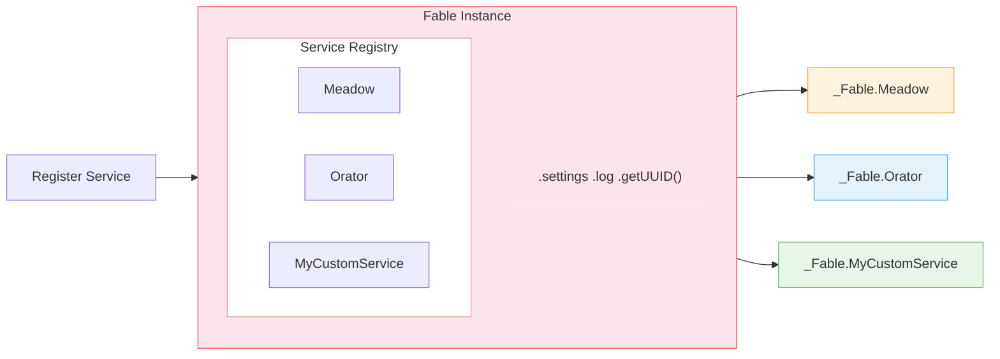

# Fable — Core Ecosystem

Fable is the foundation of every Retold application. It provides dependency injection, configuration management, logging, UUID generation, and a collection of utility services. Every other Retold module depends on Fable.

## What Fable Provides

When you create a Fable instance, you get:

- **Service provider registry** — Register, discover, and inject services by type
- **Configuration** — Merge settings from files, defaults, and runtime overrides
- **Logging** — Six log levels with extensible output streams
- **UUID generation** — RFC 4122 v4 UUIDs or configurable random strings
- **Expression parser** — Evaluate mathematical and logical expressions with 80+ built-in functions
- **REST client** — Make HTTP requests from Node.js or the browser
- **Template engine** — Render templates with data binding
- **Date utilities** — Date parsing and formatting
- **Data format helpers** — Clean numbers, pad strings, format values

## Core Service Modules

### [Fable](/fable/fable/)

The main module. Creates the service container and bundles all core services.

```javascript
const libFable = require('fable');

let _Fable = new libFable({
    Product: 'MyApp',
    ProductVersion: '1.0.0',
    LogLevel: 3
});

// All services are immediately available
_Fable.log.info('Started');
_Fable.log.trace(`UUID: ${_Fable.getUUID()}`);
```

**npm:** `fable` · **Version:** 3.1.x

---

### [Fable-ServiceProviderBase](/fable/fable-serviceproviderbase/)

The base class that all Retold services extend. Provides the registration and dependency injection mechanics.

Every service gets:
- `this.fable` — Reference to the Fable instance
- `this.log` — Shortcut to logging
- `this.options` — Service-specific options
- `this.serviceType` — The registered service type name
- `this.Hash` — Unique identifier for this service instance

```javascript
const libServiceProviderBase = require('fable-serviceproviderbase');

class MyService extends libServiceProviderBase
{
    constructor(pFable, pOptions, pServiceHash)
    {
        super(pFable, pOptions, pServiceHash);
        this.serviceType = 'MyService';
    }

    doSomething()
    {
        this.log.info('MyService is doing something');
        let tmpUUID = this.fable.getUUID();
        return tmpUUID;
    }
}

// Register with Fable
_Fable.addAndInstantiateServiceType('MyService', MyService);
```

**npm:** `fable-serviceproviderbase` · **Version:** 3.0.x

---

### [Fable-Settings](/fable/fable-settings/)

A tolerant configuration chain. Loads settings from files, merges with defaults, and allows runtime overrides.

```javascript
// Settings merge in order: defaults → file → constructor → runtime
let _Fable = new libFable({
    Product: 'MyApp',
    MySQL: {
        Server: 'localhost',
        User: 'root',
        Database: 'mydb'
    }
});

// Access settings
let tmpServer = _Fable.settings.MySQL.Server;

// Override at runtime
_Fable.settings.MySQL.Server = 'production-host';
```

**npm:** `fable-settings` · **Version:** 3.0.x

---

### [Fable-Log](/fable/fable-log/)

Flexible logging with six levels and extensible output streams.

| Level | Method | Use |
|-------|--------|-----|
| 0 | `log.trace()` | Granular debugging |
| 1 | `log.debug()` | Development debugging |
| 2 | `log.info()` | Normal operation |
| 3 | `log.warn()` | Potential issues |
| 4 | `log.error()` | Errors |
| 5 | `log.fatal()` | Critical failures |

Set `LogLevel` in configuration to control which messages appear. Messages at the configured level and above are shown.

```javascript
let _Fable = new libFable({ LogLevel: 2 }); // info and above

_Fable.log.trace('Not shown');
_Fable.log.info('Shown');
_Fable.log.error('Shown');
```

**npm:** `fable-log` · **Version:** 3.0.x

---

### [Fable-UUID](/fable/fable-uuid/)

UUID generation for identity and uniqueness.

```javascript
// RFC 4122 v4 UUID
let tmpUUID = _Fable.getUUID();
// → '83853f9c-732c-4225-9a20-abcde47c6ddb'

// Random string (configurable length and character set)
let tmpRandom = _Fable.fable.UUID.getUUID({ length: 12 });
```

**npm:** `fable-uuid` · **Version:** 3.0.x

---

### [Fable-Log-Logger-Bunyan](/fable/fable-log-logger-bunyan/)

A structured logging provider that routes Fable-Log output to Bunyan for production environments with JSON-formatted, machine-parseable log streams.

**npm:** `fable-log-logger-bunyan` · **Version:** 1.0.x

## The Service Provider Pattern

Fable's core design pattern: modules register as services and discover each other through the Fable instance.



Services can be registered by type (`addServiceType`) or instantiated on registration (`addAndInstantiateServiceType`). Multiple instances of the same type can coexist with different hashes.

## Related Modules

| Module | Description |
|--------|-------------|
| [fable](/fable/fable/) | Core module with all services |
| [fable-serviceproviderbase](/fable/fable-serviceproviderbase/) | Base class for all services |
| [fable-settings](/fable/fable-settings/) | Configuration management |
| [fable-log](/fable/fable-log/) | Logging library |
| [fable-uuid](/fable/fable-uuid/) | UUID generation |
| [fable-log-logger-bunyan](/fable/fable-log-logger-bunyan/) | Bunyan log provider |
