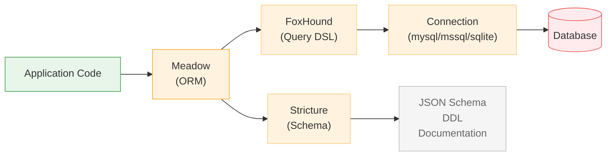

# Meadow — Data Access Layer

Meadow provides provider-agnostic data access for Retold applications. Define your entities once, and Meadow handles CRUD operations, query generation, schema management, and audit tracking across MySQL, MSSQL, SQLite, or in-browser ALASQL.

## How the Pieces Fit



**Meadow** is the data broker — it exposes CRUD methods, handles audit columns, and delegates query building and execution to FoxHound and the connection provider.

**FoxHound** generates SQL from a fluent API. Write one query definition; get correct SQL for any supported dialect.

**Stricture** defines schemas in a simple MicroDDL format and generates JSON, SQL DDL, documentation, and Meadow schema files from a single source of truth.

## Core Modules

### [Meadow](/meadow/meadow/)

The central data broker. Each Meadow instance represents one data entity (table).

```javascript
const libFable = require('fable');
const libMeadow = require('meadow');

let _Fable = new libFable({
    Product: 'BookStore',
    MySQL: { Server: 'localhost', User: 'root', Database: 'bookstore' }
});

let _BookMeadow = _Fable.instantiateServiceProvider('Meadow',
{
    Scope: 'Book',
    DefaultSchema: require('./Book-Schema.json')
});
```

**Built-in operations:**

| Operation | Method | Description |
|-----------|--------|-------------|
| Create | `.doCreate(record, callback)` | Insert a new record |
| Read | `.doRead(id, callback)` | Get one record by ID |
| Reads | `.doReads(query, callback)` | Get multiple records with filtering |
| Update | `.doUpdate(record, callback)` | Update an existing record |
| Delete | `.doDelete(id, callback)` | Soft-delete a record |
| Undelete | `.doUndelete(id, callback)` | Restore a soft-deleted record |
| Count | `.doCount(query, callback)` | Count matching records |

**Automatic features:** audit columns (CreatingIDUser, UpdatingIDUser, CreateDate, UpdateDate), soft deletes (Deleted flag + DeleteDate), GUID uniqueness (GUIDBook column), and data marshalling.

**npm:** `meadow` · **Version:** 2.0.x

---

### [FoxHound](/meadow/foxhound/)

A fluent query DSL that generates dialect-specific SQL.

```javascript
let tmpQuery = _Fable.instantiateServiceProvider('FoxHound')
    .setScope('Book')
    .addFilter('Author', 'Tolkien')
    .addFilter('YearPublished', '1954', '>=')
    .setSort('Title')
    .setBegin(0).setCap(10)
    .buildReadQuery();

// MySQL:  SELECT * FROM Book WHERE Author = 'Tolkien'
//         AND YearPublished >= '1954' ORDER BY Title LIMIT 0,10
// MSSQL:  SELECT TOP 10 * FROM Book WHERE Author = 'Tolkien' ...
// SQLite: SELECT * FROM Book WHERE Author = 'Tolkien' ... LIMIT 10 OFFSET 0
```

**Supported dialects:** MySQL, MSSQL, SQLite, ALASQL (in-browser)

**Operations:** Create, Read, Update, Delete, Count — each generates the correct SQL for the configured dialect with parameterized queries to prevent injection.

**npm:** `foxhound` · **Version:** 2.0.x

---

### [Stricture](/meadow/stricture/)

A MicroDDL for rapid data model definition.

```
# Book entity
Book
	IDBook           | int    | identity | primary
	GUIDBook         | guid   | unique
	Title            | string(200)
	Author           | string(200)
	YearPublished    | int
	ISBN             | string(20)
```

From this definition, Stricture generates:

- **JSON schema** — For Meadow entity configuration
- **MySQL CREATE TABLE** — Database DDL with indexes
- **Meadow schema** — Column definitions for the data broker
- **Documentation** — Human-readable data model docs

**npm:** `stricture` · **Version:** 1.0.x

---

### [Meadow-Endpoints](/meadow/meadow-endpoints/)

Auto-generates a full REST API from a Meadow entity. Given a "Book" entity, you get:

| Route | Method | Operation |
|-------|--------|-----------|
| `GET /Books` | Reads | List with filtering and pagination |
| `GET /Books/Count` | Count | Record count |
| `GET /Book/:id` | Read | Single record by ID |
| `GET /Book/Schema` | Schema | Entity schema definition |
| `POST /Book` | Create | Insert new record |
| `PUT /Book` | Update | Modify existing record |
| `DEL /Book/:id` | Delete | Soft-delete record |
| `DEL /Book/:id/Undelete` | Undelete | Restore record |

**Behavior injection** lets you add hooks at any lifecycle point:

```javascript
_Endpoints.BehaviorModifications.setBehavior('Read-Authorize',
    function(pRequest, fCallback)
    {
        // Check permissions before allowing the read
        if (!pRequest.UserSession.authenticated)
        {
            pRequest.CommonServices.log.warn('Unauthorized access attempt');
            return fCallback('Unauthorized');
        }
        return fCallback();
    });
```

**npm:** `meadow-endpoints` · **Version:** 4.0.x

---

### [Retold-Data-Service](/meadow/retold-data-service/)

An all-in-one Fable service that assembles a Stricture schema into a complete REST API — Meadow entity, endpoints, and connection — in a single service instantiation.

```javascript
let _BookService = _Fable.instantiateServiceProvider('RetoldDataService',
{
    Scope: 'Book',
    Schema: BookSchema
});

// That's it — full CRUD REST API is ready to be wired to Orator
```

**npm:** `retold-data-service` · **Version:** 2.0.x

## Connection Modules

| Module | Database | npm |
|--------|----------|-----|
| [meadow-connection-mysql](/meadow/meadow-connection-mysql/) | MySQL / MariaDB | `meadow-connection-mysql` |
| [meadow-connection-mssql](/meadow/meadow-connection-mssql/) | Microsoft SQL Server | `meadow-connection-mssql` |
| [meadow-connection-sqlite](/meadow/meadow-connection-sqlite/) | SQLite (via better-sqlite3) | `meadow-connection-sqlite` |

Each connection module provides a pooled database connection as a Fable service. Swap between databases by changing which connection module you install — no application code changes needed.

## Supporting Modules

| Module | Purpose | npm |
|--------|---------|-----|
| [bibliograph](/meadow/bibliograph/) | Key-value record comprehension for change tracking in ingestion pipelines | `bibliograph` |
| [parime](/meadow/parime/) | Generic data lake behaviors and services | `parime` |
| [retold-harness](/meadow/retold-harness/) | Pre-built API harness with a bookstore demo (8 entities, 10,000+ records) | `retold-harness` |
| [meadow-integration](/meadow/meadow-integration/) | Data integration tools for CSV import and schema mapping | `meadow-integration` |
| [meadow-graph-client](/meadow/meadow-graph-client/) | Client for pulling related record sets from relational database graphs | `meadow-graph-client` |

## All Meadow Modules

| Module | Description |
|--------|-------------|
| [meadow](/meadow/meadow/) | Provider-agnostic data broker and ORM |
| [foxhound](/meadow/foxhound/) | Fluent query DSL with multi-dialect SQL generation |
| [stricture](/meadow/stricture/) | MicroDDL schema definition and code generation |
| [meadow-endpoints](/meadow/meadow-endpoints/) | Automatic RESTful CRUD endpoint generation |
| [meadow-connection-mysql](/meadow/meadow-connection-mysql/) | MySQL connection provider |
| [meadow-connection-mssql](/meadow/meadow-connection-mssql/) | MSSQL connection provider |
| [meadow-connection-sqlite](/meadow/meadow-connection-sqlite/) | SQLite connection provider |
| [retold-data-service](/meadow/retold-data-service/) | All-in-one schema-to-REST-API service |
| [retold-harness](/meadow/retold-harness/) | Demo API harness with bookstore dataset |
| [bibliograph](/meadow/bibliograph/) | Record-level change tracking |
| [parime](/meadow/parime/) | Data lake behaviors |
| [meadow-integration](/meadow/meadow-integration/) | Data integration and CSV import |
| [meadow-graph-client](/meadow/meadow-graph-client/) | Relational graph record fetching |
