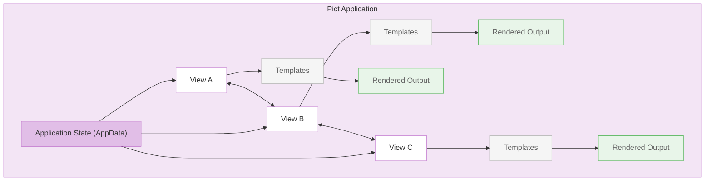

# Pict — MVC Tools

Pict provides a non-opinionated set of Model-View-Controller tools for building user interfaces. Its core insight: UI is text. Whether you are rendering to a browser DOM, a terminal, or generating strings for another system, Pict treats the output as rendered text and gives you a consistent set of tools for managing views, templates, data, and application lifecycle.

## Design Philosophy

Pict does not impose opinions about what MVC means. It provides discrete tools — Views, Templates, Providers, and an Application class — that you can use individually or compose together.

- **Views** manage lifecycle (initialize, render, marshal data) and render templates into target containers
- **Templates** are text with expressions that resolve against application state
- **Providers** fetch and manage data for views
- **The Application class** coordinates view lifecycle and shared state



## Core Modules

### [Pict](/pict/pict/)

The main module. Creates the application context, manages template and view registries, provides the template expression engine, and coordinates rendering.

```javascript
const libPict = require('pict');

let _Pict = new libPict({
    Product: 'MyApp',
    DefaultRenderable: true
});

// Register a template
_Pict.TemplateProvider.addTemplate('HelloTemplate',
    '<h1>Hello {~Data:Record.Name~}!</h1>');

// Set some data
_Pict.AppData.Record = { Name: 'World' };
```

**Template expressions** use the `{~ ~}` syntax to resolve data, call templates, invoke providers, and perform logic:

| Expression | Purpose | Example |
|-----------|---------|---------|
| `{~Data:Path~}` | Resolve data from AppData | `{~Data:Record.Name~}` |
| `{~Template:Name~}` | Render another template | `{~Template:Header~}` |
| `{~Each:Array:Template~}` | Iterate and render | `{~Each:Records:RowTemplate~}` |
| `{~If:Condition~}` | Conditional rendering | `{~If:Record.Active~}` |

**npm:** `pict` · **Version:** 1.0.x

---

### [Pict-View](/pict/pict-view/)

The View base class. Views manage a complete lifecycle — initialization, rendering, data marshaling (two-way binding), CSS injection, and teardown.

```javascript
const libPictView = require('pict-view');

class MyView extends libPictView
{
    constructor(pFable, pOptions, pServiceHash)
    {
        super(pFable, pOptions, pServiceHash);
        this.serviceType = 'MyView';
    }

    onBeforeRender()
    {
        this.log.info('About to render');
    }

    onAfterMarshalFromView()
    {
        // Data has been pulled from the DOM back into AppData
    }
}
```

**View lifecycle:** Initialize → Render → Solve → Marshal From View → Marshal To View

**npm:** `pict-view` · **Version:** 1.0.x

---

### [Pict-Template](/pict/pict-template/)

Base class for custom template handlers. Extend this to add new template expression types beyond the built-in set.

**npm:** `pict-template` · **Version:** 1.0.x

---

### [Pict-Provider](/pict/pict-provider/)

Base class for data providers. Providers fetch, transform, and deliver data to views.

**npm:** `pict-provider` · **Version:** 1.0.x

---

### [Pict-Application](/pict/pict-application/)

Application base class that coordinates multiple views, manages shared state, and provides structured lifecycle management for complete applications.

```javascript
const libPictApplication = require('pict-application');

class MyApp extends libPictApplication
{
    constructor(pFable, pOptions, pServiceHash)
    {
        super(pFable, pOptions, pServiceHash);
        this.serviceType = 'MyApp';
    }

    onAfterInitialize()
    {
        // Register views, load data, start rendering
    }
}
```

**npm:** `pict-application` · **Version:** 1.0.x

## Section Modules

Sections are pre-built view patterns for common UI needs.

### [Pict-Section-Form](/pict/pict-section-form/)

Configuration-driven dynamic forms. Define form layout, fields, validation, and data binding in JSON — the section handles rendering, data marshaling, and mathematical solving.

Supports 13+ input types with custom providers for each. Used extensively for building data entry interfaces without writing HTML by hand.

**npm:** `pict-section-form` · **Version:** 1.0.x

---

### [Pict-Section-Recordset](/pict/pict-section-recordset/)

CRUD views (Create, Read, Update, Delete) based on Meadow endpoint schemas. Provides list views, detail views, and record management with data provider integration.

**npm:** `pict-section-recordset` · **Version:** 1.0.x

---

### [Pict-Section-TUIGrid](/pict/pict-section-tuigrid/)

Toast UI Grid integration for tabular data display. Provides spreadsheet-like data grids with sorting, filtering, and editing.

**npm:** `pict-section-tuigrid` · **Version:** 1.0.x

---

### [Pict-Section-Content](/pict/pict-section-content/)

Markdown parsing and content rendering with Mermaid diagrams and KaTeX math equations. Provides a reusable provider for markdown-to-HTML conversion and a styled view with post-render hooks.

**npm:** `pict-section-content`

---

### [Pict-Section-Flow](/pict/pict-section-flow/)

Flow diagram section for visual workflow and process representations.

**npm:** `pict-section-flow`

## Application Modules

| Module | Purpose | npm |
|--------|---------|-----|
| [pict-docuserve](/pict/pict-docuserve/) | Single-page documentation viewer built on Pict with catalog navigation and search | `pict-docuserve` |
| [pict-nonlinearconfig](/pict/pict-nonlinearconfig/) | Nonlinear configuration manager | `pict-nonlinearconfig` |

## Supporting Modules

| Module | Purpose | npm |
|--------|---------|-----|
| [pict-router](/pict/pict-router/) | Hash-based URL routing via Navigo with template string route functions | `pict-router` |
| [pict-panel](/pict/pict-panel/) | Control panel component, hot-loadable from CDN | `pict-panel` |
| [informary](/pict/informary/) | Dependency-free browser form marshaling with undo/redo and field-level deltas | `informary` |
| [cryptbrau](/pict/cryptbrau/) | Simple in-browser symmetric encryption | `cryptbrau` |
| [pict-serviceproviderbase](/pict/pict-serviceproviderbase/) | Base classes for Pict services with pre-initialization support | `pict-serviceproviderbase` |
| [pict-service-commandlineutility](/pict/pict-service-commandlineutility/) | CLI utility tools built on Commander | `pict-service-commandlineutility` |
| [pict-terminalui](/pict/pict-terminalui/) | Blessed-based terminal interface for Pict views | `pict-terminalui` |

## All Pict Modules

| Module | Description |
|--------|-------------|
| [pict](/pict/pict/) | Core MVC module with template engine |
| [pict-template](/pict/pict-template/) | Custom template handler base class |
| [pict-view](/pict/pict-view/) | View base class with full lifecycle |
| [pict-provider](/pict/pict-provider/) | Data provider base class |
| [pict-application](/pict/pict-application/) | Application lifecycle management |
| [pict-panel](/pict/pict-panel/) | Hot-loadable control panel |
| [pict-nonlinearconfig](/pict/pict-nonlinearconfig/) | Nonlinear configuration manager |
| [pict-section-flow](/pict/pict-section-flow/) | Flow diagram section |
| [pict-docuserve](/pict/pict-docuserve/) | Single-page documentation viewer |
| [cryptbrau](/pict/cryptbrau/) | In-browser symmetric encryption |
| [informary](/pict/informary/) | Browser form marshaling with undo/redo |
| [pict-service-commandlineutility](/pict/pict-service-commandlineutility/) | CLI utility tools |
| [pict-section-recordset](/pict/pict-section-recordset/) | CRUD record management views |
| [pict-section-content](/pict/pict-section-content/) | Markdown parsing and content rendering |
| [pict-section-form](/pict/pict-section-form/) | Configuration-driven dynamic forms |
| [pict-section-tuigrid](/pict/pict-section-tuigrid/) | Toast UI Grid tabular data |
| [pict-router](/pict/pict-router/) | Hash-based URL routing |
| [pict-serviceproviderbase](/pict/pict-serviceproviderbase/) | Pict service base classes |
| [pict-terminalui](/pict/pict-terminalui/) | Blessed-based terminal interface |
