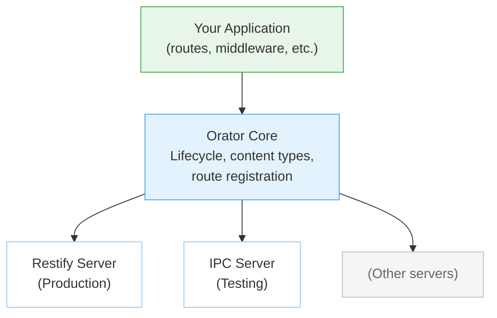

# Orator — API Server

Orator provides an unopinionated HTTP server abstraction for Retold applications. It wraps service server implementations (Restify for production, IPC for testing) behind a consistent interface, so your application code does not depend on any specific HTTP library.

## How It Works



Your application registers routes, middleware, and lifecycle hooks with Orator. Orator delegates to whichever service server implementation is configured — Restify for real HTTP, IPC for in-process testing.

## Core Modules

### [Orator](/orator/orator/)

The main server abstraction. Manages lifecycle, route registration, and service server delegation.

```javascript
const libFable = require('fable');
const libOrator = require('orator');

let _Fable = new libFable({
    Product: 'MyAPI',
    APIServerPort: 8080
});

let _Orator = _Fable.instantiateServiceProvider('Orator');

// Register routes
_Orator.addRoute('GET', '/health', function(pRequest, pResponse, fNext)
{
    pResponse.send({ status: 'ok' });
    return fNext();
});

// Start the server
_Orator.startService(function(pError)
{
    _Fable.log.info('Server listening on port 8080');
});
```

**Lifecycle hooks** let you inject behavior at server startup, before/after route handling, and at shutdown:

```javascript
_Orator.addPreStartFunction(function(fCallback) { /* ... */ return fCallback(); });
_Orator.addPreRouteFunction(function(pRequest, pResponse, fNext) { /* ... */ return fNext(); });
```

**npm:** `orator` · **Version:** 5.0.x

---

### [Orator-ServiceServer-Restify](/orator/orator-serviceserver-restify/)

Production HTTP server powered by Restify. Provides full HTTP support, body parsing, CORS, middleware, and configurable listen options.

This is the server implementation used for real deployments. Install it alongside Orator and it registers itself automatically.

```javascript
const libOrator = require('orator');
require('orator-serviceserver-restify');

// Restify server is now the active service server
```

**npm:** `orator-serviceserver-restify` · **Version:** 2.0.x

---

### [Orator-Static-Server](/orator/orator-static-server/)

Static file serving for Orator with MIME type detection, default file support, subdomain-based folder routing, and configurable route prefix stripping.

```javascript
_Orator.addStaticRoute('/app', '/var/www/app/dist');
```

**npm:** `orator-static-server` · **Version:** 1.0.x

---

### [Orator-HTTP-Proxy](/orator/orator-http-proxy/)

Reverse proxy for forwarding requests to backend services. Supports multiple HTTP verbs and handles HTTP-to-HTTPS translation.

```javascript
_Orator.addProxyRoute('/api/external', 'https://backend.example.com/api');
```

**npm:** `orator-http-proxy` · **Version:** 1.0.x

---

### [Tidings](/orator/tidings/)

An extensible reporting system for generating HTML, PDF, and other format reports. Provides asset collection, templating, and rasterization in a micro-service-friendly pattern.

**npm:** `tidings` · **Version:** 1.0.x

---

### [Orator-Endpoint](/orator/orator-endpoint/)

A base class for creating reusable, pluggable API endpoint handlers that can be shared across Orator applications.

**npm:** `orator-endpoint` · **Version:** 1.0.x

## Typical Setup

A standard API server combines Orator with Meadow-Endpoints:

```javascript
const libFable = require('fable');
const libOrator = require('orator');
const libMeadowEndpoints = require('meadow-endpoints');
require('orator-serviceserver-restify');

let _Fable = new libFable({
    Product: 'BookAPI',
    APIServerPort: 8086,
    MySQL: { Server: 'localhost', User: 'root', Database: 'bookstore' }
});

let _Orator = _Fable.instantiateServiceProvider('Orator');

// Create a data entity and wire its endpoints to Orator
let _BookEntity = _Fable.instantiateServiceProvider('Meadow',
    { Scope: 'Book', DefaultSchema: BookSchema });
let _BookEndpoints = _Fable.instantiateServiceProvider('MeadowEndpoints',
    { Entity: _BookEntity });
_BookEndpoints.connectRoutes(_Orator);

// Start serving
_Orator.startService((pError) =>
{
    _Fable.log.info('BookAPI running on :8086');
});
```

This gives you a full REST API with Create, Read, Reads, Update, Delete, Undelete, Count, and Schema endpoints for the Book entity — all auto-generated.

## All Orator Modules

| Module | Description |
|--------|-------------|
| [orator](/orator/orator/) | HTTP server abstraction with lifecycle hooks |
| [orator-serviceserver-restify](/orator/orator-serviceserver-restify/) | Production HTTP server via Restify |
| [orator-static-server](/orator/orator-static-server/) | Static file serving with MIME detection |
| [orator-http-proxy](/orator/orator-http-proxy/) | HTTP reverse proxy pass-through |
| [tidings](/orator/tidings/) | Reporting scaffolding for HTML/PDF output |
| [orator-endpoint](/orator/orator-endpoint/) | Reusable endpoint base class |
| [orator-conversion](/orator/orator-conversion/) | File format conversion endpoints |
