# Retold Todo List Example

A complete example demonstrating the full Retold stack: an API server with
Meadow endpoints, a Pict web client, a blessed console client, and a
command-line utility -- all connected to the same SQLite backend through a
shared REST API.

## Architecture

```mermaid
graph TB
    subgraph model["Shared Data Model"]
        mddl["Task.mddl<br/><i>Stricture MicroDDL</i>"]
        compiled["Task-Compiled.json<br/><i>DDL for table creation</i>"]
        schema["MeadowSchema-Task.json<br/><i>ORM schema, types, defaults</i>"]
        csv["seeded_todo_events.csv<br/><i>1,000 sample tasks</i>"]
        mddl --> compiled
        mddl --> schema
    end

    subgraph server["API Server &ensp;·&ensp; Orator + Meadow + SQLite"]
        orator["Orator<br/><i>HTTP server (Restify)</i>"]
        endpoints["Meadow Endpoints<br/><i>Auto-generated REST CRUD</i>"]
        dal["Meadow DAL<br/><i>Task entity ORM</i>"]
        dbinit["DatabaseInitializationService<br/><i>Table creation &amp; CSV seeding</i>"]
        sqlite[("todo.sqlite")]
        static["Static file server<br/><i>Serves web-client/dist/</i>"]

        orator --- endpoints
        endpoints --- dal
        dal --- sqlite
        dbinit --> dal
        orator --- static
    end

    compiled --> dbinit
    schema --> dal
    csv --> dbinit

    subgraph web["Web Client &ensp;·&ensp; Pict Application"]
        wapp["TodoList-Application<br/><i>Lifecycle, routing, state</i>"]
        wprov["Provider-TaskData<br/><i>API fetch, query builder</i>"]
        wrouter["PictRouter<br/><i>Hash-based SPA routing</i>"]

        subgraph wviews["Views"]
            wlayout["View-Layout<br/><i>Nav bar + content outlet</i>"]
            wlist["View-TaskList<br/><i>Sortable table, search, pagination</i>"]
            wform["View-TaskForm<br/><i>Add / edit task form</i>"]
            wweek["View-WeekView<br/><i>Week calendar grid</i>"]
            wmonth["View-MonthView<br/><i>Month calendar grid</i>"]
            wyear["View-YearView<br/><i>Year overview cards + table</i>"]
        end

        wapp --- wprov
        wapp --- wrouter
        wapp --- wlayout
        wlayout --- wlist
        wlayout --- wform
        wlayout --- wweek
        wlayout --- wmonth
        wlayout --- wyear
    end

    subgraph console["Console Client &ensp;·&ensp; blessed TUI"]
        capp["TodoListConsoleApplication<br/><i>Screen, widgets, key bindings</i>"]
        ctui["pict-terminalui<br/><i>Pict → blessed bridge</i>"]

        subgraph cviews["Views"]
            clayout["TUI-Layout<br/><i>Header / content / status</i>"]
            cheader["TUI-Header<br/><i>Title + keybinding bar</i>"]
            clist["TUI-TaskList<br/><i>Scrollable task rows</i>"]
            cstatus["TUI-StatusBar<br/><i>Count, sort, status message</i>"]
        end

        subgraph cmodals["Modals"]
            cview["View Detail<br/><i>Read-only task info</i>"]
            cedit["Edit / Add<br/><i>Sequential field prompts</i>"]
            csort["Sort Picker<br/><i>10 sort options</i>"]
            csearch["Search<br/><i>Name + description filter</i>"]
        end

        capp --- ctui
        ctui --- clayout
        clayout --- cheader
        clayout --- clist
        clayout --- cstatus
        capp --- cview
        capp --- cedit
        capp --- csort
        capp --- csearch
    end

    subgraph cli["CLI Client &ensp;·&ensp; pict-service-commandlineutility"]
        cliapp["TodoCLI-CLIProgram<br/><i>Commander.js bootstrap</i>"]
        cliapi["TodoCLI-Service-API<br/><i>HTTP client + query builder</i>"]

        subgraph clicmds["Commands"]
            clilist["list<br/><i>Search, sort, filter, paginate</i>"]
            cliadd["add<br/><i>Create a new task</i>"]
            cliremove["remove<br/><i>Delete a task by ID</i>"]
            clicomplete["complete<br/><i>Mark a task done</i>"]
        end

        cliapp --- cliapi
        cliapp --- clilist
        cliapp --- cliadd
        cliapp --- cliremove
        cliapp --- clicomplete
    end

    wprov -- "fetch()" --> orator
    static -- "HTML + JS + CSS" --> web
    capp -- "http.request()" --> orator
    cliapi -- "http.request()" --> orator
```



## Quickstart

### Prerequisites

- Node.js 18+

### 1. Start the API Server

```bash
cd server
npm install
npm start
```

The server starts on **http://localhost:8086**.  On first run it creates a
SQLite database at `server/data/todo.sqlite`, builds the Task table from the
compiled Stricture DDL, and seeds 1,000 sample tasks from the CSV through the
Meadow DAL (so every record gets a GUID, audit timestamps, and defaults
automatically).

Meadow Endpoints auto-generates the full REST API:

| Method | Endpoint | Description |
|--------|----------|-------------|
| GET | `/1.0/Tasks/0/50` | List tasks (paginated) |
| GET | `/1.0/Tasks/FilteredTo/{filter}/0/50` | List with sort, search, filter |
| GET | `/1.0/Task/:id` | Get a single task |
| POST | `/1.0/Task` | Create a task |
| PUT | `/1.0/Task` | Update a task |
| DELETE | `/1.0/Task/:id` | Delete a task |
| GET | `/1.0/Tasks/Count` | Record count |

### 2. Build and Open the Web Client

In a second terminal:

```bash
cd web-client
npm install
npm run build
```

Then open **http://localhost:8086** in your browser.  The server serves the
built web client as static files.

The web client is a Pict Application with hash-based routing.  It includes a
sortable task list with search and pagination, an add/edit form, and three
calendar views (week, month, year) -- all styled with the Sagebrush color
theme.

### 3. Run the Console Client

In a third terminal (server must be running):

```bash
cd console-client
npm install
npm start
```

A blessed terminal UI that connects to the same API.  Navigate with arrow keys:

| Key | Action |
|-----|--------|
| Enter | View task detail |
| E | Edit selected task |
| A | Add a new task |
| D | Delete selected task |
| S | Open sort picker |
| / | Search by name or description |
| R | Refresh from server |
| Q | Quit |

### 4. Use the CLI Client

In any terminal (server must be running):

```bash
cd cli-client
npm install
```

Then use the `todo` command (via `node source/TodoCLI-Run.js` or `npx todo`
after install):

```bash
# List tasks (newest first, up to 50)
npx todo list

# List with options
npx todo list --search garden --limit 10
npx todo list --column Name --direction ASC
npx todo list --status Pending

# Add a task
npx todo add "Water the plants" --due 2026-03-15 --hours 0.5

# Mark a task complete
npx todo complete 42

# Remove a task
npx todo remove 42

# See all commands
npx todo --help
```

## Running with Docker

If you have Docker installed you can skip the per-component setup and run
everything in a container. The image installs all four components, builds the
web client, and seeds the database on first start.

### Quick Start (server only)

```bash
./docker-run.sh
```

This builds the image and starts the API server. Open **http://localhost:8086**
in your browser for the web client.

### Interactive Shell

```bash
./docker-shell.sh
```

This builds the image and drops you into a bash shell inside the container. A
help banner lists the available commands. To use the CLI or console client,
start the server in the background first:

```bash
node server/server.cjs &
cd /app/cli-client && npx todo list
```

Or launch the console TUI:

```bash
node server/server.cjs &
node console-client/console-client.cjs
```

## What Each Component Does

### Shared Data Model (`model/`)

The Task entity is defined once and shared by every component.

| File | Role |
|------|------|
| `Task.mddl` | Stricture MicroDDL source -- one-line-per-field schema notation |
| `Task-Compiled.json` | Compiled DDL consumed by the SQLite table creator |
| `MeadowSchema-Task.json` | Meadow ORM schema with column types, defaults, and JSON Schema |
| `data/seeded_todo_events.csv` | 1,000 realistic tasks spanning four years of family life |

### API Server (`server/`)

A thin orchestration layer -- most behavior comes from Retold modules.

| File | Role |
|------|------|
| `server.cjs` | Wires Fable, Orator, Meadow, and SQLite together.  Loads the schema, creates the DAL, generates REST endpoints, and starts the HTTP server.  Also serves static files from `web-client/dist/`. |
| `database-initialization-service.cjs` | Fable service that creates tables from compiled DDL and seeds data from CSV through the Meadow DAL on first run. |

### Web Client (`web-client/`)

A browser-based Pict Application built with Quackage.

| File | Role |
|------|------|
| `source/TodoList-Application.cjs` | Application class -- registers views, providers, and router.  Manages shared state in `AppData.TodoList`. |
| `source/providers/Provider-TaskData.cjs` | Data provider that builds FilteredTo query URLs and fetches from the API. |
| `source/providers/Router-Config.json` | Route table mapping hash paths to views. |
| `source/views/View-Layout.cjs` | Root layout with Sagebrush-themed navigation bar and `#TodoList-Content` outlet. |
| `source/views/View-TaskList.cjs` | Paginated data table with sort dropdown, search bar, and per-row edit/delete actions. |
| `source/views/View-TaskForm.cjs` | Create/edit form with Name, Description, DueDate, Hours, and Status fields. |
| `source/views/calendar/View-WeekView.cjs` | Seven-day calendar grid with task counts per day. |
| `source/views/calendar/View-MonthView.cjs` | Full month grid with day cells showing complete/open counts. |
| `source/views/calendar/View-YearView.cjs` | Twelve month overview cards plus a summary table. |
| `css/todolist-theme.css` | Shared Sagebrush theme stylesheet (loaded via `<link>` in `index.html`). |
| `html/index.html` | HTML shell -- loads Pict, the application bundle, and the theme CSS. |

### Console Client (`console-client/`)

A terminal UI using blessed widgets, bridged to Pict views through pict-terminalui.

| File | Role |
|------|------|
| `console-client.cjs` | Application class with blessed screen setup, keyboard navigation, four modal dialogs (view, edit, sort, search), and HTTP client for API calls. |
| `views/PictView-TUI-Layout.cjs` | Root blessed layout (header + content + status bar). |
| `views/PictView-TUI-Header.cjs` | Title bar with keybinding reference. |
| `views/PictView-TUI-TaskList.cjs` | Scrollable task list rendered from AppData with selection highlighting. |
| `views/PictView-TUI-StatusBar.cjs` | Status line showing task count, status message, and current sort. |

### CLI Client (`cli-client/`)

A non-interactive command-line tool built on pict-service-commandlineutility (Commander.js + Fable service container).

| File | Role |
|------|------|
| `source/TodoCLI-Run.js` | Shebang entry point for the `todo` bin command. |
| `source/TodoCLI-CLIProgram.js` | Bootstrap -- registers commands and the API service. Configurable via `.todo-cli.json`. |
| `source/services/TodoCLI-Service-API.js` | Fable service wrapping `http.request()` with JSON parsing and FilteredTo URL construction. |
| `source/commands/list/TodoCLI-Command-List.js` | `todo list` -- tabular output with `--search`, `--column`, `--direction`, `--limit`, `--status` options. |
| `source/commands/add/TodoCLI-Command-Add.js` | `todo add <name>` -- create a task with `--due`, `--hours`, `--description`, `--status`. |
| `source/commands/remove/TodoCLI-Command-Remove.js` | `todo remove <id>` -- delete a task by ID. |
| `source/commands/complete/TodoCLI-Command-Complete.js` | `todo complete <id>` -- mark a task as complete (fetches first, skips if already done). |

## Retold Patterns Demonstrated

| Pattern | Where |
|---------|-------|
| Fable service provider | All components |
| Orator HTTP server (Restify) | `server/server.cjs` |
| Meadow DAL + SQLite | `server/server.cjs` |
| Meadow Endpoints (auto REST) | `server/server.cjs` |
| Stricture MicroDDL | `model/Task.mddl` |
| Provider-based table creation | `server/database-initialization-service.cjs` |
| CSV seed data via Meadow DAL | `server/database-initialization-service.cjs` |
| Pict Application lifecycle | `web-client/source/TodoList-Application.cjs` |
| Pict Views + Templates | `web-client/source/views/` |
| Pict Providers | `web-client/source/providers/Provider-TaskData.cjs` |
| Pict Router (hash routing) | `web-client/source/providers/Router-Config.json` |
| TemplateSet iteration | `web-client/source/views/View-TaskList.cjs` |
| View CSS injection | `web-client/source/views/` (inline `/*css*/` strings) |
| Quackage build system | `web-client/` build config |
| pict-terminalui + blessed | `console-client/console-client.cjs` |
| ContentAssignment override | `console-client/` (Pict → blessed widget bridge) |
| pict-service-commandlineutility | `cli-client/source/TodoCLI-CLIProgram.js` |
| Command-per-folder pattern | `cli-client/source/commands/` |
| Fable custom service | `cli-client/source/services/TodoCLI-Service-API.js` |

## Data Model

The Task entity is defined in Stricture MicroDDL (`model/Task.mddl`):

```
!Task
@IDTask
%GUIDTask
$Name 200
*Description
&DueDate
.LengthInHours 10,2
$Status 32
&CreateDate
#CreatingIDUser -> IDUser
&UpdateDate
#UpdatingIDUser -> IDUser
^Deleted
&DeleteDate
#DeletingIDUser -> IDUser
```

| Field | Type | Description |
|-------|------|-------------|
| IDTask | AutoIdentity | Primary key |
| GUIDTask | AutoGUID | UUID identifier |
| Name | String(200) | Task name |
| Description | Text | Task description |
| DueDate | DateTime | Due date |
| LengthInHours | Decimal(10,2) | Estimated hours |
| Status | String(32) | Pending, In Progress, or Complete |

## Seed Data

The file `model/data/seeded_todo_events.csv` contains 1,000 realistic task
events spanning four years, including personal errands, work tasks, birthdays,
holidays, bills, vet appointments and more.

On first run the `DatabaseInitializationService` checks whether the Task table
is empty.  If it is, it reads the CSV and inserts each row through the Meadow
DAL using `doCreate()`, so every record gets a proper GUID, audit timestamps
and default values -- exactly as if a user had created them through the API.

To re-seed, delete `server/data/todo.sqlite` and restart the server.
